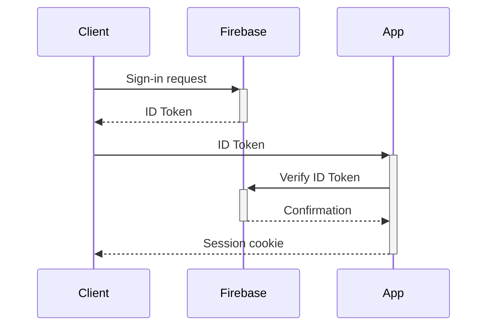
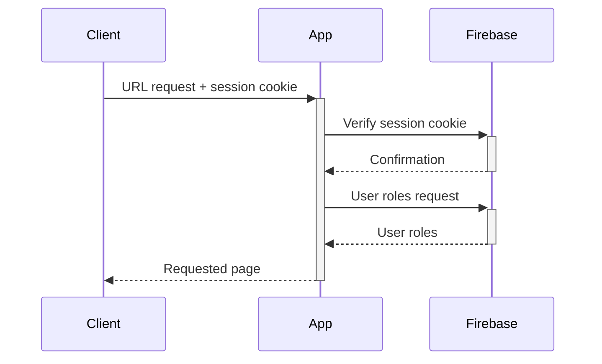
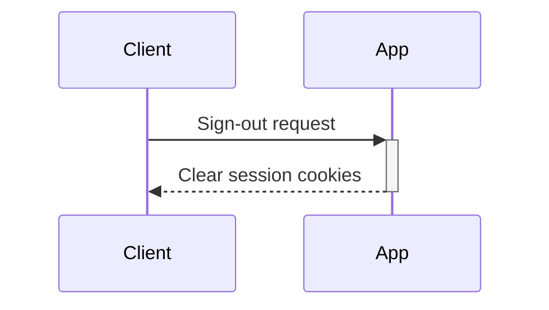

# Authentication and RBAC with Firebase

How to add authentication and authorization (custom RBAC) to your application in Locaria.

Under the AAEE department, there are existing efforts to unify access control to our apps in a single instance.
There are several advantages such as:
- Ready to use solution that saves time implementing RBAC to new and exsiting apps
- Comply with company security policies
- Centralized site to control access to apps, which enhances security and maintaniability

## How it works

High level description of the authentication + authorisation flow.

### Sign-in



### Subsequent requests



### Sign-out



## Set up

This document describes how to protect a simple Flask app, it can run locally or hosted in any machine/serverless platform like App Engine or Cloud Run.
 It uses the test environment, if its a production app, use the production environment.

### Set necessary credentials

This part describes the steps to get the necessary credentials for you app to use Firebase authentication. Choose one of the following options:

#### Option A: Using service account (recommended)

1. Go to your GCP project and create a service account (if you already have one, skip this step). 
This service account will be the one you application uses to authenticate to Firebase.
Check the full guide on [Create a service account](https://cloud.google.com/iam/docs/service-accounts-create#creating).

```
gcloud iam service-accounts create SERVICE_ACCOUNT_NAME \
  --description="DESCRIPTION" \
  --display-name="DISPLAY_NAME"
```

Replace the following values:

- `SERVICE_ACCOUNT_NAME`: the name of the service account

- `DESCRIPTION`: an optional description of the service account

- `DISPLAY_NAME`: a service account name to display in the Google Cloud console

> Step 2 requires a Firebase admin, as it grants a role inside the admin project. If you are not an admin, please ask an admin to perform this step.
2. Go to the GCP project linked to the Firebase project (usually same name), in the IAM page, grant the role `Authenticator User` (projects/*PROJECT_ID*/roles/authenticatorUser) to your service account at project level. Check the guide [Grant a single role](https://cloud.google.com/iam/docs/granting-changing-revoking-access#grant-single-role).

```
gcloud projects add-iam-policy-binding PROJECT_ID \
  --member="serviceAccount:SERVICE_ACCOUNT_EMAIL" \
  --role="projects/PROJECT_ID/roles/authenticatorUser"
```
Replace the following values:

- `PROJECT_ID`: the Firebase project ID

- `SERVICE_ACCOUNT_EMAIL`: the full address of the service account created in the previous step, like SERVICE_ACCOUNT_NAME@my-project.iam.gserviceaccount.com

> IMPORTANT: Skip the rest of steps (3 and 4) if you are running your application in a serverless environment where the service account `SERVICE_ACCOUNT_EMAIL` is already being used to authenticate.

3. [Create and download the service account key](https://cloud.google.com/iam/docs/keys-create-delete#creating):

```
gcloud iam service-accounts keys create KEY_FILE \
    --iam-account=SERVICE_ACCOUNT_EMAIL
```
Replace the following values:

- `KEY_FILE`: The path to a new output file for the private key—for example, ~/sa-private-key.json.
- `SERVICE_ACCOUNT_EMAIL`: the full address of the service account created in the previous step, like SERVICE_ACCOUNT_NAME@my-project.iam.gserviceaccount.com

To download the key:
- Use scp (Secure Copy) to transfer the file to your local machine.
Open a terminal on your local machine and run:
```sh
gcloud cloud-shell scp cloudshell:~/sa-private-key.json .
```
This will copy the file to your current local directory.

- Use the Cloud Shell file transfer button.
In the Google Cloud Console, open Cloud Shell and run:
```sh
ls ~/sa-private-key.json
```
to confirm the file exists. Then, click on the three-dot menu in Cloud Shell and select "Download file".
Enter `~/sa-private-key.json` as the file path.

4.  Use the service account key file to [authenticate your application as a service account](https://cloud.google.com/docs/authentication/provide-credentials-adc#wlif-key). You can run the following command in the terminal from you IDE, replacing `KEY_PATH` with the path of the JSON file that contains your credentials (i.e.: "/home/user/Downloads/service-account-file.json"):

```
export GOOGLE_APPLICATION_CREDENTIALS="KEY_PATH"
```

#### Option B: Using your email account

> NOTE: Your email account needs to have access to the Firebase project. Contact the team in charge to verify this.

In the terminal fro your IDE, run the following command to create local authentication credentials for your user account:

```
gcloud auth application-default login
```

Set up the quota project to the `PROJECT_ID` where you plan to run your application in.

```
gcloud auth application-default set-quota-project PROJECT_ID
```

### Authorise your domain

For security, to use Google authentication, domains need to be authorised for OAuth redirects.  
If you are running your application locally, `localhost` is already authorised for that purpose.
If your application runs on a host, you will have to authorise that domain to allow redirects after Google sign-in.  

Please ask an admin to authorise your domain in the Authenticator service.  
For example, if your application runs on App Engine, the base URL is the domain:

URL &rarr; domain  
https://locaria-dev-budget-tracker.ew.r.appspot.com/config &rarr; locaria-dev-budget-tracker.ew.r.appspot.com

> Your app must have a static domain. If you app is hosted, for example, in a Compute Engine instance with an ephemeral external IP address,
you can use a third-party service like https://www.duckdns.org/ to generate a static domain and dynamically update the IP using their API.

### Enable required APIs

To be able to communicate with the Firebase authentication system, you need to [enable](https://cloud.google.com/endpoints/docs/openapi/enable-api) the `Identity Toolkit API` in your GCP project `YOUR_PROJECT_ID` (the one where your app will run). You can run the following commands in yout terminal:

```
gcloud config set project YOUR_PROJECT_ID
```

```
gcloud services enable identitytoolkit.googleapis.com
```

### Add authentication to your Flask app

Below you will find some code you can add and customize to fit in your application. 

#### Library imports

```py
from flask import Flask, render_template, request, jsonify, redirect, url_for, session
from firebase_admin import credentials, auth, initialize_app
import functools
from google.cloud import firestore
```

If not already, install the firebase_admin and firestore libraries. You can use pip, like:
```
pip install firebase-admin
pip install google-cloud-firestore
```

#### Flask secret, Firebase admin and Firestore

Set a Flask secret key to encrypt the sessions and initialize the Firebase admin app with the Firebase project ID (`FIREBASE_PROJECT_ID`). If you are using the service account option to authenticate, you don't need to pass the Firebase project ID. Replace the secret key with one unique. You can use an [online generator](https://www.lastpass.com/features/password-generator). This code needs to go after the Flask app definition `app = Flask(__name__)`.  
The code also initializes the Firestore database used to read permissions from the user.

```py
app = Flask(__name__)
app.secret_key = "ZvE1_y6om*'6Ow2£x%VA{o$(IxHaEd"  # Replace with a secure key
# Initialize Firebase Admin SDK with Application Default Credentials
initialize_app(options={"projectId":"FIREBASE_PROJECT_ID"})
# Initialize Firestore  
db = firestore.Client(project="FIREBASE_PROJECT_ID")  
```
#### Utility function
Defines a utility function used by the decorator (see below) to get the permissions assigned to a user.

Add the following code right after the Firebase admin initialisation.

```py
# Get user permissions
def get_user_permissions(user_id):
    """Retrieve user's permissions from Firestore for a specific app."""
    role_bindings_ref = db.collection("bindings").document(user_id)
    role_bindings = role_bindings_ref.get().to_dict()

    if role_bindings:
        roles = role_bindings.get("roles", [])
        permissions = set()

        for role in roles:
            role_doc = db.collection("roles").document(role).get()
            if role_doc.exists:
                permissions.update(role_doc.to_dict().get("permissions", []))

        return permissions
    return set()
```

#### Protection decorator
Defines a protection decorator that can be added to any present Flask route to protect it. Meaning that, the decorator will intercept the request, and check if the user is authenticated and authorized to access that route before serving it. 

Add the following code right after the Firebase admin initialisation.

```py
# Middleware to check authentication and authorisation
def route_protected_with_permissions(admitted_permissions: list = []):
    """Decorator used to protect route functions behind Firebase login and custom RBAC.

    Returns:
        The protected function.
    """
    def decorator(f):
        @functools.wraps(f)
        def decorated_function(*args, **kwargs):
            session_cookie = session.get("session_cookie")
            if not session_cookie:
                # Store the requested URL in the session to redirect the user later
                session["next_url"] = request.path
                # Session cookie is unavailable. Force user to login.
                return redirect(url_for("login"))
            
            # Verify the session cookie. In this case an additional check is added to detect
            # if the user's Firebase session was revoked, user deleted/disabled, etc.
            try:
                decoded_claims = auth.verify_session_cookie(session_cookie, check_revoked=True)
                # Force a fresh pull of the latest user info from Firebase
                user = auth.get_user(decoded_claims["uid"])
                # Pass it to protected function so it can use custom logic
                kwargs['user_record'] = user
                if admitted_permissions is None:
                    # Return the function as there are no roles required (only authentication needed)
                    return f(*args, **kwargs)

                # Get latest role info and verify if user has access (authorization)
                user_permissions = get_user_permissions(user.email)
                matched_permissions = [permission for permission in user_permissions if permission in admitted_permissions]
                if user_permissions and matched_permissions:
                    # If any of the roles assigned to the user matches any of the admitted roles, return the function
                    return f(*args, **kwargs)
                return render_template("unauthorised.html", user_email=decoded_claims["email"])
            except auth.InvalidSessionCookieError:
                # Session cookie is invalid, expired or revoked. Force user to login.
                return redirect(url_for("login"))
        return decorated_function
    return decorator
```

If the user is not authenticated, it will redirect to the login page. If the user is not authorized, it will render the unauthenticated page. You may change this and any other logic by modifying this decorator function.

#### Add the login and logout routes

This routes must be present if using the provided decorator. If you modify the name of these, you may need to adapt the decorator as well and other functions. The login template renders the login page, which must be within the templates of your application.   

The logout basically clears the session and redirects to the login page. If you modify this, make sure at least you clear the session, as the access cookies are stored there.

```py
@app.route("/login")
def login():
    """Handle login request.

    Returns:
        Render login page.
    """

    return render_template("login.html")

@app.route("/logout")
def logout():
    """Handle logout request.
    Clears the session and redirects the user to the login page.

    Returns:
        Redirects to login page.
    """

    session.clear()
    return redirect(url_for("login"))
```

Even after clearing the session cookie, the session remains active in Firebase until the expiration time has passed. If you want to clear that too, make a call to `auth.revoke_refresh_tokens(...)` as described in [this guide](https://firebase.google.com/docs/auth/admin/manage-cookies#sign_out).

### Add the authentication callback

This route will be called by the Firebase login popup after authentication in the client happens. This provides an ID Token that this callback must verify and, if valid, saves the session cookie for subsequent requests. We set the cookie because we basically don't want the user to go through the login flow every time they click on our page.

```py
@app.route("/auth_callback", methods=["POST"])
def auth_callback():
    """Handle Firebase authentication request.
    This function receives the ID Token provided by Firebase, verifies it and handles the respone.
    If successfull, it will store session data for subsequent requests to the app.

    Returns:
        The result of the authentication as JSON.
    """

    id_token = request.json.get("idToken")
    try:
        # Verify the token
        decoded_token = auth.verify_id_token(id_token, clock_skew_seconds=10)
        
        # Store basic user info in the session
        session["user_id"] = decoded_token["uid"]
        session["user_email"] = decoded_token.get("email")
        
        # Store session cookie to validate all calls to the app
        # Define the session expiration time. Comment to disable expiration.
        expires_in = datetime.timedelta(days=SESSION_EXPIRATON_DAYS)
        session_cookie = auth.create_session_cookie(id_token, expires_in=expires_in)
        session["session_cookie"] = session_cookie
        
        # Retrieve and clear the next URL from the session
        next_url = session.pop("next_url", url_for("root"))
        
        # Handle the response
        return jsonify({"status": "success", "redirect_url": next_url})
    except Exception as e:
        return jsonify({"status": "error", "message": str(e)})
```

#### Protect your existing routes

Add the protection decorator `@route_protected_with_permissions()` right after the `@app.route()` decorator of the URLs you want to protect. The protection decorator accepts a list of admitted permissions (strings). The user must have at least one of the admited permissions to be able to call that URL, if not, it will be redirected to the unauthorised page.

If you add the decorator empty (without arguments), it will only check if the user is authenticated.

> **IMPORTANT**: Your route function must accept the `user_record`. This is to allow your function to perform further custom checks if necessary and get info from the user calling it. The value passed is of type [``firebase_admin.auth.UserRecord``](https://firebase.google.com/docs/reference/admin/python/firebase_admin.auth#firebase_admin.auth.UserRecord).    
For example, you could get the full name of the user to display it in the page by calling `user_record.display_name` inside the function.

Below is an example on how to implement it on the root route:

```py
@app.route("/")
@route_protected_with_permissions(["app.root.get"])
def root(user_record):
    """Returns the main page.

    Returns:
        HTML page rendered from index.html.
    """

    user_email = user_record.email

    return render_template("index.html", user_email=user_email)
```

This route will only be accessible if the user has a role that contains the `app.root.get` permission.
The roles could be assigned as follows:
```python
import firebase_admin
from firebase_admin import credentials, firestore
from pathlib import Path
from typing import List, Dict, Optional
import sys
import time

current_dir = Path().resolve()
parent_dir = current_dir.parent
if str(parent_dir) not in sys.path:
    sys.path.append(str(parent_dir))

SCRIPT_PATH = Path().resolve()
DIRECTORY_PATH = SCRIPT_PATH
FIREBASE_SERVICE_ACCOUNT = str(DIRECTORY_PATH / "auth/SA-authenticator.json")


class AuthenticationUserManager:
    """
    Manages users, roles, and permissions within the Firestore database for authentication and authorization.
    Initializes Firebase and Firestore connections and provides functions for managing collections: 
    - 'bindings' for user-role associations
    - 'roles' for role-permission associations
    - 'permissions' for permission details
    """

    def __init__(self, project_id: str, firebase_service_account: str = FIREBASE_SERVICE_ACCOUNT):
        """
        Initializes the Firebase app and Firestore client with the specified project ID and service account path.

        Args:
            project_id: The GCP project ID for the Firebase project.
            firebase_service_account: Path to the Firebase service account JSON file.
        """
        # Initialize Firebase if it hasn't been initialized yet
        if not firebase_admin._apps:
            cred = credentials.Certificate(firebase_service_account)
            firebase_admin.initialize_app(cred, options={"projectId": project_id})

        # Initialize Firestore client
        self.db = firestore.client()

        # Collection references
        self.bindings_ref = self.db.collection("bindings")
        self.roles_ref = self.db.collection("roles")
        self.permissions_ref = self.db.collection("permissions")

    # ========== FUNCTIONS FOR BINDINGS COLLECTION ==========
    def create_user(self, email: str, roles: Optional[List[str]] = None) -> None:
        """Creates a user in the 'bindings' collection and optionally assigns roles."""
        user_data = {"roles": roles if roles else []}
        self.bindings_ref.document(email).set(user_data)
        print(f"Created user with email '{email}'.")

        if roles:
            self.add_roles_to_user(email, roles)

    def delete_user(self, email: str) -> None:
        """Deletes a user from the 'bindings' collection."""
        user_doc = self.bindings_ref.document(email)
        if user_doc.get().exists:
            user_doc.delete()
            print(f"Deleted user with email '{email}'.")
        else:
            print(f"No user found with email '{email}' to delete.")

    def add_roles_to_user(self, email: str, roles: List[str]) -> None:
        """Adds multiple roles to a user's role array in the 'bindings' collection."""
        user_doc = self.bindings_ref.document(email)
        user_doc.update({"roles": firestore.ArrayUnion(roles)})
        print(f"Added roles {roles} to user '{email}'.")

    def remove_roles_from_user(self, email: str, roles: List[str]) -> None:
        """Removes multiple roles from a user's role array in the 'bindings' collection."""
        user_doc = self.bindings_ref.document(email)
        user_doc.update({"roles": firestore.ArrayRemove(roles)})
        print(f"Removed roles {roles} from user '{email}'.")

    # ========== FUNCTIONS FOR ROLES COLLECTION ==========
    def add_permissions_to_role(self, role: str, permissions: List[str]) -> None:
        """Adds multiple permissions to a role's permissions array in the 'roles' collection."""
        role_doc = self.roles_ref.document(role)
        role_doc.update({"permissions": firestore.ArrayUnion(permissions)})
        print(f"Added permissions {permissions} to role '{role}'.")

    def remove_permissions_from_role(self, role: str, permissions: List[str]) -> None:
        """Removes multiple permissions from a role's permissions array in the 'roles' collection."""
        role_doc = self.roles_ref.document(role)
        role_doc.update({"permissions": firestore.ArrayRemove(permissions)})
        print(f"Removed permissions {permissions} from role '{role}'.")

    def create_user_role(self, role: str, description: str) -> None:
        """Creates role and sets or updates the description of a role in the 'roles' collection."""
        role_doc = self.roles_ref.document(role)
        role_doc.set({"description": description}, merge=True)
        print(f"Set description for role '{role}': {description}")

    # ========== FUNCTIONS FOR PERMISSIONS COLLECTION ==========
    def create_permissions(self, permissions: Dict[str, str]) -> None:
        """Creates or updates multiple permissions in the 'permissions' collection."""
        for permission, description in permissions.items():
            self.permissions_ref.document(permission).set({"description": description})
            print(f"Set permission '{permission}' with description: '{description}'")

    def delete_permissions(self, permissions: List[str]) -> None:
        """Deletes multiple permissions from the 'permissions' collection."""
        for permission in permissions:
            self.permissions_ref.document(permission).delete()
            print(f"Deleted permission '{permission}' from the 'permissions' collection.")

    # ========== FUNCTIONS FOR GETTING DATA ==========
    def get_user_roles(self, email: str) -> List[str]:
        """Retrieves roles assigned to a user in the 'bindings' collection."""
        user_doc = self.bindings_ref.document(email).get()
        if user_doc.exists:
            return user_doc.to_dict().get("roles", [])
        else:
            print(f"No user found with email: {email}")
            return []

    def get_role_permissions(self, role: str) -> List[str]:
        """Retrieves permissions assigned to a role in the 'roles' collection."""
        role_doc = self.roles_ref.document(role).get()
        if role_doc.exists:
            return role_doc.to_dict().get("permissions", [])
        else:
            print(f"No role found with name: {role}")
            return []
```

```python
auth_manager.create_permissions(permissions={
        "assetQC.default.access": "Default user access to the quality checker tool.",
    }
)

auth_manager.create_user_role(role="assetQC.default", description="default user, with full access to the tool.")

auth_manager.add_permissions_to_role(
    role="assetQC.default", 
    permissions=[
        "assetQC.default.access"
    ]
)

# auth_manager.create_user(email="pablo@example.com", roles=["timeTracker.default", "fin_prof.admin", "transcraibe.user", "budgetTracker.editor"])
```

```python
auth_manager.get_user_roles(email="pablo@example.com")
```

```python
auth_manager.add_roles_to_user(email="pablo@example.com", roles=["assetQC.default"])
```
#### Add the login HTML template

You must add a login page to you app templates, that handles the call to the Firebase client to trigger the Sign-in popup, and call the authentication route to verify the ID Token. You can find an example in this repo `login.html` with a basic script and a button to trigger the authentication flow. 

You may (must) customize it to fit your app style.

Basically, these are the component that needs to be present in your Sign-in page:

Inside the head, the Firebase app and auth components:

```html
<script src="https://www.gstatic.com/firebasejs/11.0.1/firebase-app-compat.js"></script>
<script src="https://www.gstatic.com/firebasejs/11.0.1/firebase-auth-compat.js"></script>
```

Inside the head, the initialization script:

```html
<script>
    const firebaseConfig = {
        apiKey: API_KEY,
        authDomain: AUTH_DOMAIN,
        projectId: FIREBASE_PROJECT_ID
    };
      
    // Initialize Firebase
    firebase.initializeApp(firebaseConfig);
</script>
```

You must replace:
- `API_KEY`: The API client key from the Firebase app
- `AUTH_DOMAIN`: The Firebase app domain
- `FIREBASE_PROJECT_ID`: The Firebase app project ID

Inside the body, add an element that the user must interact with to start the authentication flow (call javascript function `signInWithGoogle`), like a button:

```html
<button onclick="signInWithGoogle()">Login with Google</button>
```

Inside the body, append the following script to trigger the authentication flow in the client side:

```html
<script>
    const auth = firebase.auth();
    
    /**
     * Triggers Google sign-in with Firebase
     */
    function signInWithGoogle() {
        const provider = new firebase.auth.GoogleAuthProvider();
        auth.signInWithPopup(provider)
            .then((result) => {
                return result.user.getIdToken();
            })
            .then((idToken) => {
                // Process the asynchronous request to verify the token
                fetch('/auth_callback', {
                    method: 'POST',
                    headers: { 'Content-Type': 'application/json' },
                    body: JSON.stringify({ 'idToken': idToken }),
                }).then(response => response.json()).then(response => {
                    if (response.status == "success") {
                        // Redirect the user to previous selected route (defaults to root)
                        // Customize this part to handle sign-in success
                        window.location.href = response.redirect_url;
                    } else {
                        // Customize this part to handle token verification failure
                        alert("Authentication failed.");
                    }
                });
            })
            .catch((error) => {
                // Customize this part to handle sign-in flow failure
                console.error("Error during sign-in:", error);
                alert("There was an error during sign-in. Try again later.\nIf the error persists, contact the team in charge.");
            });
    }
</script>
```

You may customize the function to adapt the sign-in flow to you app.

#### Add the unauthorised HTML template

You must add an unauthorised page to you app templates if you are implementing this auth as is. Basically this template is rendered when the user tries to access a protected URL without the necessary roles. You can find an example in this repo `unauthorised.html`.

You may (must) customize it to fit your app style.

If you have customized the unauthorized flow, you don't have add this.

#### Add the logout option

Add the logout option to ALL HTML templates in your app (except login). 
You may add this as a simple link to the `/logout` URL.

```html
<a href="/logout">Log out</a>
```

Please, customize it to fit you page style (or not).

#### Document the roles

> NOTE: In the RBAC model (Role-Based Access Control), a user is assigned one or more roles.
Each role is a list of permissions that define what actions can the user perform in your application.
Your application must check the permissions the user has before serving the request.

When documenting you app, also document the permissions and the roles needed to access the different features of it. Provide a brief description of each role and permission, and to what it provide access. Basically describe what roles and permissions are needed to do what.

Take the following example for `myblog.com` app:

**List of available permissions:**
- ``myblog.stories.read``: List the stories posted in myblog
- ``myblog.stories.create``: Post a new story in myblog
- ``myblog.stories.update``: Update an existing story in myblog
- ``myblog.stories.comment``: Post a comment in a story
- ``myblog.stories.delete``: Delete an existing story

**Table of predefined roles:**
| Role 	| Description 	| Permissions 	|
|---	|---	|---	|
| myblog.viewer 	| Read the stories posted in myblog 	| myblog.stories.read 	|
| myblog.commenter 	| Read stories and comment on them 	| myblog.stories.read<br>myblog.stories.comment 	|
| myblog.moderator 	| Manage all posted stories in myblog 	| myblog.stories.read <br>myblog.stories.comment <br>myblog.stories.update <br>myblog.stories.delete 	|
| myblog.editor 	| Create and manage all posted stories in myblog 	| myblog.stories.create <br>myblog.stories.read <br>myblog.stories.comment <br>myblog.stories.update <br>myblog.stories.delete 	|

Once documented, the roles and permissions must be created and assigned.  

When naming the roles and permissions please try to follow these rules:
- Use the `yourAppName.roleName` pattern to name your roles. Like `budgetTracker.admin` or `serbianMoose.spotter` 
- Use the `yourAppName.resourceName.actionName` pattern to name your permissions. Like `budgetTracker.report.get`
- Use camel case notation for the names. Like "Locaria's Unofficial Minecraft Server" &rarr; `locariaUnofficialMinecraftServer`


#### (Optional) Implement access control in lower levels fo your app

The implementation logic provided let you protect different routes of your application with one or more admitted permissions,
however this can be extended to provide lower level permission checks. For example, the route might admit different HTPP Methos, and you want to protect each method with a diferent permission.

To do this, you can create a helper function like `user_has_permission(user_email, permission)`:

```py
def user_has_permission(user_email: str, permission: str) -> bool:
    user_permissions = get_user_permissions(user_email)
    return permission in user_permissions
```

Then call it inside your protected route function to check permission:

```py
@app.route('/stories', methods=['GET', 'POST', 'DELETE'])
@route_protected_with_permission() # Leave blank to only require authentication, chack roles later
def stories_route(user_record):
    user_email = user_record.email # Get authenticated user email
    
    if request.method == 'GET' and user_has_permission(user_email, 'myblog.stories.read'):
        # Return if user has myblog.stories.read permission
        return render_template('stories.html', user_email=user_email, stories=get_stories())
    elif request.method == 'POST' and user_has_permission(user_email, 'myblog.stories.create'):
        # Return if user has myblog.stories.create permission
        story = request.json.get('story')
        result = create_story(story)
        return jsonify({"message": result})
    elif request.method == 'DELETE' and user_has_permission(user_email, 'myblog.stories.delete'):
        # Return if user has myblog.stories.delete permission
        story = request.json.get('story')
        result = delete_story(story)
        return jsonify({"message": result})
    else:
        return render_template("unauthorised.html")
```
