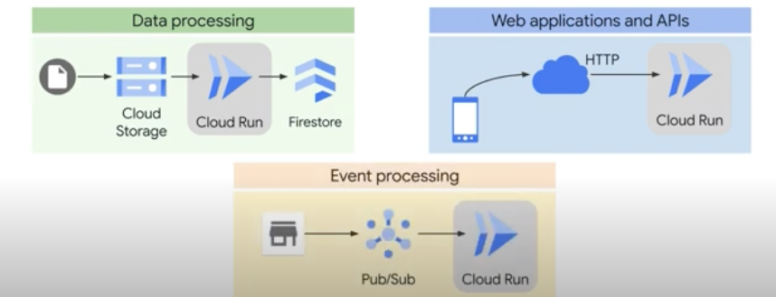
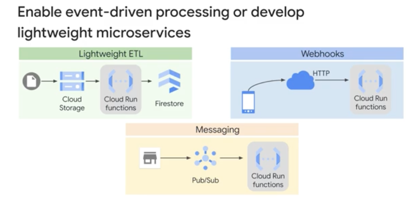

◀️ [Home](../../../../README.md)

## Compute Options
Google Cloud has a range of compute options that you can use to run your applications. You can choose a platform that matches the needs of your application, including the level of control that you need for the infrastructure. Having more control over the infrastructure usually leads to a greater operational burden.

> "Where should I run my applications?", the best answer is that you should run each application on the platform that best fits its requirements. Most applications written with the Cloud Client Libraries can be easily moved from platform to platform, so you can change your decision later. If you do not have complex infrastructure requirements, start with a serverless platform that lets you focus on the application instead of the infrastructure. If you later want more control over the infrastructure, you can move your application to a platform that requires more operational effort but provides the needed control or flexibility.

Google Cloud provides a wide range of platforms on which to run your applications.
- Compute Engine lets you create virtual machines, or VMs, that mimic the servers you might have used in a traditional data center. Virtual machines are highly flexible: they let you run the same wide range of applications you can run on physical hardware, but now on Google's infrastructure.
- Google Kubernetes Engine, or GKE, is Google Cloud's managed service for running containers and managing the virtual machines used to run them. With GKE, a cluster of virtual machines is created for running your containerized applications. When you deploy applications to the cluster, GKE manages the scaling and security for the cluster and applications, reducing the operational costs of running your applications.
- Cloud Run is a fully managed serverless platform that also runs containerized applications. Unlike with GKE, all infrastructure management for Cloud Run is abstracted away. Cloud Run automatically scales up and down from zero almost instantaneously, depending on traffic. You only pay when your code is running.
- Cloud Run functions also lets you run your code in the cloud with zero management of servers or containers. Write your event-driven code, and Google Cloud manages everything, scaling from zero to planet-scale.

### Compute Engine
Compute Engine is the most flexible option for running your applications, but it requires the most operational effort to manage. With Compute Engine, you create high-performance virtual machines and then install and run your applications on them. Compute Engine supports predefined machine types for popular configurations but also lets you create custom machine types to customize CPU and memory for your VMs. Compute Engine lets you create and attach persistent disks and local SSDs.

Compute Engine provides preemptible VMs that are ideal for large compute and batch jobs. If capacity must be reclaimed, Google Cloud can terminate preemptible VMs. You can run your choice of operating system on your VMs, including Debian, CentOS, Ubuntu, and various other flavors of Linux or Windows. Also, can autoscale the number of instances based on the traffic volume in specific regions.

> Use Compute Engine when you want full control of your infrastructure. It lets you create highly customized VMs for specialized applications that have unique compute or operating system requirements. 

### Google Kubernetes Engine
Kubernetes is a leading open source platform for deploying, scaling, and operating containers. First developed at Google, is now a Cloud Native Computing Foundation project with a large and active community. Provides you with a framework to run distributed containerized systems resiliently and at scale. It manages many operational tasks, such as scaling application components, providing network abstractions, orchestrating failovers, rolling out deployments, storage orchestration, and management of secrets and configurations.

A Kubernetes cluster contains control plane and worker nodes. The nodes in a cluster are the machines—virtual or physical—that run your applications. The Kubernetes control plane manages the worker nodes and the Pods in the cluster. A Pod is a group of containers that share networking and storage resources on the node.

Google Kubernetes Engine, or GKE, is a managed Kubernetes service on Google infrastructure. GKE helps you deploy, manage, and scale Kubernetes environments for your containerized applications on Google Cloud. More specifically, GKE is a component of the Google Cloud compute offerings that facilitates bringing your Kubernetes workloads into the cloud. GKE handles much of this operational effort for you automatically by eliminating many of the infrastructure tasks required to create and manage a Kubernetes cluster.

> Google manages the control plane, scaling of Pods, node patching and upgrades, and the monitoring, availability, and reliability of the cluster. By default, you manage the underlying nodes and node pools, including provisioning, maintenance, and lifecycle management. You're also responsible for selecting the security and networking configuration for your cluster.

GKE supports any application runtime that you can package as a Docker image.

Although you can deploy ad hoc resources directly by using kubectl commands, the recommended best practice is to use YAML manifest files to define configurations. These files define the properties of the containers that are used for the components in your applications. They can also define the network services, security policies, and other Kubernetes objects that are used to deliver resilient, scalable, containerized applications.

> Cloud Build, Artifact Registry, Cloud Deploy, and GKE can be used to create a strong CI/CD system.

### Cloud Run
Cloud Run is a fully managed compute platform that allows you to run request or event-driven stateless workloads without having to worry about servers. It abstracts away all infrastructure management such as provisioning, configuring, and managing servers, so you can focus on writing code. It automatically scales up and down from zero, almost instantaneously, depending on traffic, so you never have to worry about scale configuration. Cloud Run also charges you only for the resources you use, rounded up to the nearest 100 milliseconds, so you never pay for overprovisioned resources. You only pay for the CPU, memory, and networking that are consumed during request handling.

The Cloud Run developer workflow is a straightforward three-step process.
1. First, use your favorite programming language to write your application. This application should listen for web requests.
2. Second, build and package your application into a container image.
3. Finally, deploy the container image to Cloud Run. When you deploy your container image, you get a unique HTTP(S) URL.

> A container image is a lightweight, standalone, and executable package that includes everything needed to run a piece of software. This includes:
> - The code of the application
> - Dependencies (libraries, runtime, binaries)
> - Environment settings (configuration files, variables)
> - System tools

> Key Points:
> - Immutable: Once built, it doesn’t change.
> - Portable: Can run consistently across different environments (e.g., local, cloud, Kubernetes).
> - Used to create containers: A container is a running instance of a container image.

You can also use Cloud Scheduler to run a job on a regular schedule. In addition, tasks that fail can be automatically retried.

### Cloud Run functions
With Cloud Run functions, previously known as Cloud Functions, you can develop an application that is event-driven, serverless, and highly scalable. Each function is a lightweight microservice that allows you to integrate application components and data sources. Cloud Run functions is ideal for microservices that require a small piece of code to quickly process data in response to an event. Cloud Run functions is priced according to how long your function runs, the number of invocations, and the resources that you provision for the function.

> In a serverless environment, the cloud provider automatically manages the infrastructure, scaling, and resource allocation. The application developer doesn’t need to worry about provisioning or maintaining servers.

### Comparisons

App Engine is a fully managed serverless compute option used to build and deploy low latency, highly scalable web applications. It supports two environments: standard and flexible. The App Engine standard environment runs your code in a sandbox, and doesn’t require you to build containers, a reasonable choice for non-containerized applications with spikes in traffic. The App Engine flexible environment requires you to create a container for your application, but you gain flexibility by doing so. The flexible environment is better for applications that have sustained traffic, because it scales up and down much slower than the standard environment does, and cannot scale to zero.

> Cloud Run provides many of the best features of both App Engine environments.