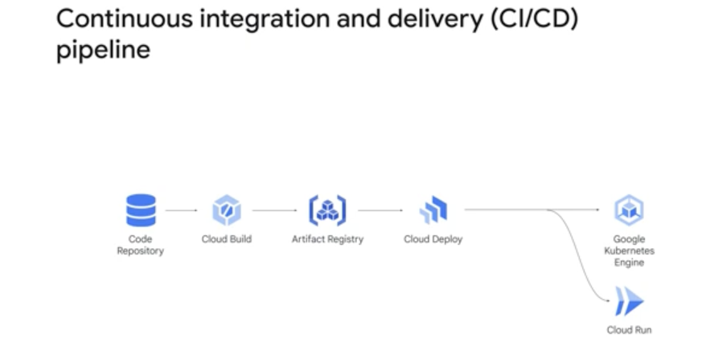

## Deploying applications

A continuous integration and continuous delivery pipeline provides a stable, repeatable process for building and deploying your applications. Continuous integration is a developer workflow that occurs when developers commit their changes into a feature branch in a code repository, and a build service like Cloud Build is automatically triggered. Rules that you have established guide the generation of your application containers and executables. Continuous delivery is a workflow triggered when changes are pushed to the main branch in the repository.

When you first get started, this diagram shows a simple CI/CD pipeline that you might build.

This type of pipeline provides an efficient and consistent build and deploy process. However, it's very important to consider security throughout the continuous integration and delivery process.

Google Cloud provides several services that will help secure your builds and deployments. Google Cloud's Software Delivery Shield is a fully managed, end-to-end software supply chain security solution that protects every step of your CI/CD process and helps you fully secure your CI/CD pipeline.

### Containers
Containers are a preferred method for packaging and deploying your applications. Container-based virtualization is an alternative to hardware virtualization, as used in traditional virtual machines. Containers start much faster than virtual machines and use fewer resources, because each container does not have its own instance of the operating system. Instead, developers configure each container with a minimal set of software libraries to do the job.

So what does a container provide that a virtual machine does not?

1. First, **containers provide a clear separation of responsibility**. Developers can focus on the application logic and any dependencies that are required for the application. The IT operations teams that will deploy and manage the application don't need to worry about application details like software versions and configurations.
2. Second, **containers provide workload portability**. Containers are lightweight and can run virtually anywhere, from a developer's laptop to a VM running on-premises or in any cloud. The same application that is tested by a developer on their laptop and tested in an integration environment can run in the production environment. This workload portability simplifies promotion of the app during the development lifecycle and lets you move workloads between clouds and data centers with minimal effort.

3. Third, **containers provide application isolation**. Containers virtualize CPU, memory, storage, and network resources at the operating system level. Applications are effectively running in their own environments, which lets containerized applications running on the same hardware use different versions of dependencies without affecting each other. By abstracting just the OS instead of the whole virtual computer, a container can "boot" in a fraction of a second. A virtual machine typically takes a minute or more to boot.

The container image for your application is a complete package that contains the application binary and all the software required for the application to run. Cloud Build is a fully managed service that lets you set up build pipelines to create a Docker container image for your application and push the image to Artifact Registry. 

By using Artifact Registry and Cloud Build, you can create build pipelines that are automatically triggered when you commit code to a repository. In Cloud Build, you can create a build trigger that is executed based on a trigger type. A trigger type specifies whether a build should be triggered based on commits to a particular branch in a repository or commits that contain a particular tag. You create a build configuration file that specifies the steps in the build pipeline.Steps are analogous to commands or scripts that you execute to build your application. Each build step is a Docker container that's invoked by Cloud Build when the build is executed. 

With Cloud Build, the artifacts produced by each build step are persisted in the /workspace folder and can be used by the following build step. The step name identifies the container to invoke for the build step. The images attribute contains the name of the container image to be created by this build configuration. Cloud Build lets you use different code repositories, tag container images to enable searches, and create build steps that perform operations like downloading and processing data. The build configuration can be specified in a YAML or JSON format.

> Continuous integration and delivery can be used to build a repeatable process for building and deploying your applications.
> We can build and maintain container images by using Cloud Build and Artifact Registry.