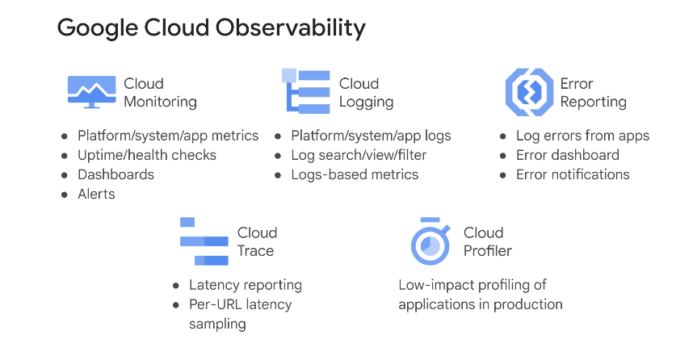

◀️ [Home](../../../../README.md)

## Monitoring and Performance Tuning

### Google Cloud Observability

The integrated managed services in Google Cloud Observability help you manage your running services and applications. It provides visibility into the performance, availability, and overall health of cloud applications. 

Monitoring is the foundation of application reliability. With Cloud Monitoring, you can build custom dashboards and use out-of-the-box dashboards to answer basic questions about your application. You should create application dashboards that include the four golden signals: Latency, traffic, errors, and saturation.
- Latency is the amount of time that it takes to serve a request. Make sure to distinguish between the latency of successful and unsuccessful requests.
- Traffic is a measure of how much demand is placed on your system.
- Errors indicate the number of failed requests.
- Saturation indicates how full your application is, or what resources are being stretched and reaching target capacity.

### Logging and metrics

A robust system of logging is crucial for developer productivity and to help you understand the state of your application. Cloud Logging is a real-time log-management system with storage, search, analysis, and monitoring support. Cloud Logging automatically collects logs from Google Cloud resources.

### Error Reporting

Error Reporting counts, analyzes, and aggregates the crashes in your running cloud services. A centralized error management interface provides sorting and filtering capabilities, and shows error details such as timing, occurrences, first and last-seen dates, and number of affected users.

### Managing performance

Cloud Trace is a distributed tracing system that collects latency data from your applications and displays it in the Google Cloud console. You can track how requests propagate through your application and receive detailed near-real time performance insights.

Cloud Profiler is a statistical, low-overhead profiler that continuously gathers CPU usage and memory-allocation information from your applications. It attributes that information to the source code that generated it, which helps you identify the parts of your application that are consuming the most resources.