◀️ [Home](../../../../README.md)

# Application Development, Testing, and Integration
## Development and Testing

### Is your application a good fit for Cloud Run?
In order to be a good fit for Cloud Run, your application needs to meet all of the following criteria. Your application:
- Serves requests, streams, or events delivered over HTTP, HTTP/2, WebSockets, or gRPC, or executes to completion.
- Does not require a local persistent file system, but either a local ephemeral file system or a network file system.
- Is built to handle multiple instances of the app running simultaneously.
- Does not require more than 8 CPU and 32 GiB of memory per instance.
- Meets one of the following criteria:
    - Is containerized.
    - Is written in Go, Java, Node.js, Python, or .NET.
    - You can otherwise containerize it.

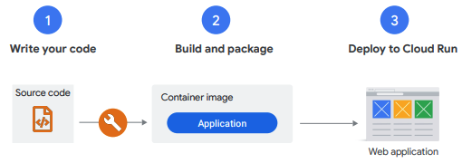

Also, building container images is optional. If you use Go, Node.js, Python, Java, .NET Core, or Ruby, you can use the source-based deployment option that builds the container for you and deploys it on Cloud Run. If you use the source-based approach, you deploy your source code, instead of a container image. Using Buildpacks, Cloud Run then builds your source, and packages the application along with its dependencies into a container image for you.

### Application on Cloud Run must handle web requests
Cloud Run supports secure HTTPS requests to your application. On Cloud Run, your application can either run continuously as a service or as a job. Cloud Run services respond to web requests, or events, while jobs perform work and quit when that work is completed. Cloud Run:
- Provisions a valid TLS certificate, and other configuration to support HTTPS requests.
- Handles incoming requests, decrypts, and forwards them to your application. Cloud Run expects your container to listen on port 8080 to handle web requests. The port number is a configurable default, so if this port is unavailable to your application, you can change the application’s configuration to use a different port. You don’t need to provide an HTTPS server, Google’s infrastructure handles that for you.

### Container runtime contract
Here are the key requirements for running containers in Cloud Run.

- Your application can be written in any programming language and must be containerized using any base image. Executables in the container image must be compiled for Linux 64-bit. Cloud Run accepts container images in the Docker Image Manifest V2, Schema 1, Schema 2, and OCI image formats.
- When running as a Cloud Run service, your container must listen for requests on the correct port. Your container instance must send a response within the time specified in the request timeout setting (max. 1 hour) after it receives a request, including the container instance startup time. Otherwise, the request is ended and a 504 error is returned.
- For Cloud Run jobs, the container must exit with exit code 0 when the job has successfully completed, and exit with a non-zero exit code when the job has failed. Because jobs should not serve requests, the container should not listen on a port or start a web server.
- The container should not implement any transport layer security directly because TLS is terminated by Cloud Run for HTTPS and gRPC. Requests are then proxied as HTTP/1 or gRPC to the container. For HTTP/2, your container must handle requests in HTTP/2 cleartext format.

### Cloud Run execution environments
Cloud Run has two execution environments that run your services and jobs: First generation, and second generation.

Cloud Run services by default operate within the first generation execution environment, which features shorter cold start times and emulation of most, but not all operating system calls. The second generation execution environment provides full Linux compatibility rather than system call emulation.

You can change the execution environment for services only. Cloud Run jobs automatically use the second generation execution environment, which cannot be changed. You can choose between the two environments based on the needs of your Cloud Run service.

The second generation execution environment provides:
- Faster CPU performance
- Faster network performance, especially in the presence of packet loss
- Full Linux compatibility, including support for all system calls, namespaces, and cgroups
- Network file system support

### File system and data storage access

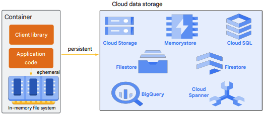

On Cloud Run, your container has access to a writable in-memory filesystem. Writing to a file from your container uses your container instance’s allocated memory. Data written to the file system does not persist when the container instance is stopped. You can use the in-memory file system as a cache, to store disposable per-request data, or configuration. If you need to persist data beyond a container instance lifetime, and you want to use standard file system semantics, you can use Filestore or other self-managed network file systems with Cloud Run. To use network file systems with Cloud Run, you must specify the second generation execution environment when you deploy your service to Cloud Run.

To access Cloud Storage as a mounted network file system onto a Cloud Run service,you can use [Cloud Storage FUSE](https://cloud.google.com/run/docs/tutorials/network-filesystems-fuse).

If you don't need a standard file system, the simplest option is to use cloud data storage client libraries. With these libraries, you can connect your Cloud Run service to Firestore, Cloud SQL, Cloud Spanner, Cloud Storage, Memorystore, and BigQuery storage services on Google Cloud.

### Cloud Code
Cloud Code is a set of plugins for popular IDEs that make it easier to create, deploy, and integrate your applications with Google Cloud. Cloud Code provides IDE support for the full development cycle of Kubernetes and Cloud Run applications, from creating and customizing a new application from sample templates to running your finished application. Cloud Code provides samples, configuration snippets, and a tailored debugging experience — making developing with Kubernetes and Cloud Run a whole lot easier. While Cloud Code works with any cloud platform, it provides a streamlined experience for easy creation of clusters hosted on Google Cloud and better integration with Google Cloud tools like Cloud Source Repositories, Cloud Storage, and Cloud Client Libraries.

#### Cloud Code templates
You can create and deploy a Cloud Run service using Intellij, Visual Studio Code (VS Code), or Cloud Shell with a Cloud Code template. To use Cloud Code, you need to install the required plugins or extensions for your IDE.

You can develop your app in VS Code and run it locally with the Cloud Run Emulator in VS Code. To build your container image locally with the emulator, install a builder such as Docker on your local machine.

To start the build, from the Cloud Code status bar in VS Code, select Run on Cloud Run Emulator. You can view the progress of the build in the output window in VSCode.

Once successfully completed, a URL to your application is generated and displayed in the output tab in VS Code. To test the application, navigate to the URL in a browser window.

Once you’ve tested your application locally, you can deploy it to Cloud Run. To deploy your application to Cloud Run, in the Cloud Code status bar in VS Code, select Deploy to Cloud Run.

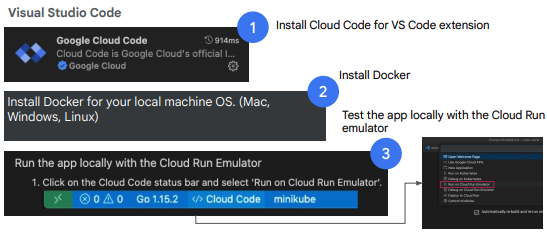
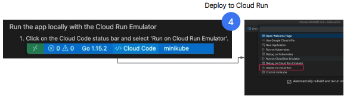

In the Deploy to Cloud Run tab, you can set your Google Cloud project, provide a name for your Cloud Run service, and select a Cloud Run region where your service will run. You can also deploy your application to the Cloud Run for Anthos platform, in which case you would need to configure Kubernetes cluster information.

You can also provide additional configuration for your service for authentication, container image URL, and service account.

Choose to build your container image locally, or use Cloud Build to build your image remotely.

Cloud Code for VS Code builds your image, pushes it to the registry, and deploys your service to Cloud Run.

The live URL to your service is displayed in the output tab in VSCode which you can access to test your application.

You can extend Cloud Code with custom templates. For more information on this topic, read the [blog post](https://cloud.google.com/blog/products/serverless/extending-cloud-code-with-custom-templates).

### Local testing
During development, you can run and test your container locally, prior to deploying it to Cloud Run. To run and test locally, you can use Cloud Code or Docker that you can install on your machine. 

As discussed previously, the Cloud Code plugin for supported IDEs lets you locally run and debug your container image in a Cloud Run emulator within your IDE. The emulator lets you configure an environment that is representative of your service running on Cloud Run. 

You can configure properties like CPU and memory allocation, specify environment variables, and set Cloud SQL database connections in Cloud Code. 

Google Cloud CLI contains a local development environment for emulating Cloud Run that can build a container from source, run the container on your local machine, and automatically rebuild the container upon source code changes. If a Dockerfile is present in the local directory, it’s used to build the container. If no Dockerfile is present, the container is built with Google Cloud's buildpacks. To test your service locally, visit http://localhost:8080/ in your browser. 

To test your container image locally using Docker, use the docker run command, providing the container image URL, and the port that your application will listen on for HTTP(S) requests. To test your service locally, visit http://localhost:port/ in your browser.

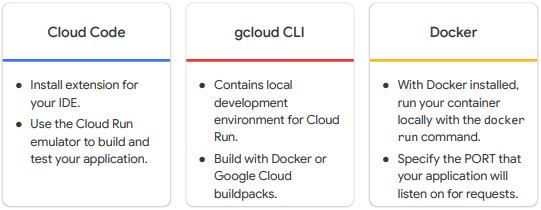

---

## Managing service deployments and revisions
### Building containers
To build your application into a container image with Docker or with Cloud Build, you can use a Dockerfile. To build a container locally, you can install Docker and use the docker build command to build your container image. To push the local container image to an image repository, use the docker push command.

You can also build your container image on Google Cloud with Cloud Build. To use Cloud Build, run the gcloud builds submit command from the gcloud CLI.

To build your container image from source code without creating a Dockerfile, you can use Buildpacks. Google provides a set of CNCF-compatible Buildpacks that build source code into container images designed to run on Google Cloud container platforms, including Cloud Run. To build a container image with Google Cloud’s buildpacks using Cloud Build, run the gcloud builds submit command with the pack flag.

Buildpacks are built into Cloud Run to enable a source-based deployment workflow. The gcloud run deploy command with the source flag builds your application source  code with a Dockerfile (if one is present), or with Google Cloud’s buildpacks. The resulting container image is also uploaded to an image repository and deployed to Cloud Run. You can also build your container image locally with Google Cloud’s buildpacks using the pack command.

### Deploying containers to Cloud Run
Before a container is deployed to Cloud Run, the container image must be stored in a repository that Cloud Run can access.

You can use container images that are stored in Artifact Registry or Docker Hub. You can also use container images from other public or private registries (like JFrog Artifactory, Nexus, or GitHub Container Registry), by setting up an Artifact Registry remote repository. Google recommends the use of Artifact Registry. You can use container images that are stored in the same project as the one you are creating the job or service in, or from other Google Cloud projects, if the correct IAM permissions are set.

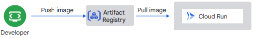

### Pushing container images to Artifact Registry

When you’re ready to deploy your container image to Cloud Run, you begin by “pushing” (that’s a term used for uploading) the image to a Docker repository in Artifact Registry.

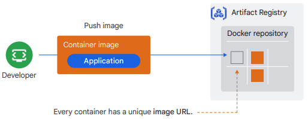

Your container image will have a unique URL in the repository, for example, us-central1-docker.pkg.dev/${PROJECT_ID}/my-repo/my-image, which you can use when you deploy the image to Cloud Run. 

### Pulling container images from Artifact Registry
After your container image has been pushed into the Docker repository, you can deploy it to a service on Cloud Run. This means you hand the container image URL to Cloud Run, which then pulls the image from Artifact Registry. To ensure that containers on Cloud Run start reliably and quickly, Cloud Run copies and stores the container image locally. The internal container storage is fast, which ensures that your image size does not impact your container startup time. Large images load as quickly as small ones. Because Cloud Run copies the image, it won’t be an issue if you accidentally delete a deployed container image from Artifact Registry. The copy ensures that your Cloud Run service will continue to work.

### Create or update a Cloud Run service
To deploy a container image to Cloud Run, use the Google Cloud console or gcloud CLI to create or update an existing service, and provide the container image URL. When you deploy a container image for the first time, Cloud Run creates a service and its first revision. There is only one container image per service. To be able to deploy, you must have one of Owner, Editor, or both the Cloud Run Admin and Service Account user roles. You can also have a custom role that includes the necessary permissions.

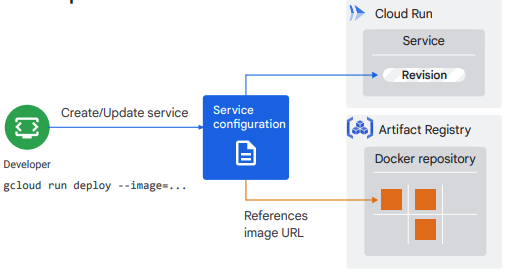

### Deploying a new service revision
Each revision of a Cloud Run service is immutable. To update your application on Cloud Run, you generally follow these steps:
1. Modify your application source code.
2. Build and package your application into a container image.
3. Push the container image to Artifact Registry.
4. Redeploy the container image to the Cloud Run service.
When you re-deploy your container image to an existing service, a new revision is automatically created. 

> Changing any configuration settings of your Cloud Run service results in the creation of a new revision, even if there is no change to the container image itself. Subsequent service revisions will also automatically get these configuration settings unless you make explicit updates to change them.

### Updating a service
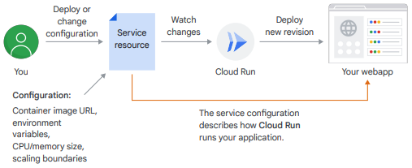

Cloud Run deploys your application after every change that you make to the service
resource. At the same time, it also makes an immutable copy of the service resource, called a revision. You can only add new revisions to make further updates. **A revision is an immutable copy of your container image and service configuration**. 

### Serving traffic
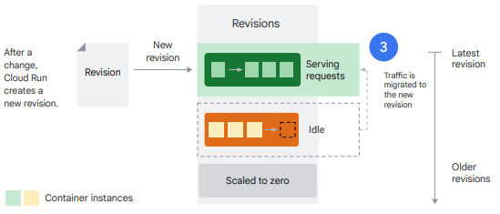

You can gradually migrate traffic to the new revision by setting the percentage of requests sent to the new revision. To perform a gradual rollout of changes to an application, a new service revision can be configured to receive no traffic initially, when deployed with the `–no-traffic` option. To gradually increase the amount of traffic received by the new service revision, you can then update the service to specify an incremental percentage value.

You can also pin request traffic to a specific service revision rather than the latest revision, decoupling the deployment of a new revision from the migration of traffic. This also means that if you add a new revision, Cloud Run will not automatically send traffic to that new revision.

Pinning to a revision is useful if you want to roll back to previous revision, or if you first want to test your new revision before migrating all request traffic to it. This is achieved by setting the percentage of request traffic to the revision to 100. You can set this in the Google Cloud console, with the gcloud CLI, a YAML configuration file, or with Terraform.

### Tagging service revisions
When you deploy a service, you can assign a tag to the new revision that lets you access the revision at a specific URL without serving traffic. You can then use that tag to gradually migrate traffic to the tagged revision, or to ro`llback a tagged revision.

A common use case for this feature is to use it for testing and vetting of a new service revision before it serves any traffic. A tagged revision has its own unique URL, which is the URL of the Cloud Run service and the name of the tag added as a prefix. For example, if you used the tag name green on the service hello, you would test the tagged revision at the URL: `https://green---hello-xyz-uc.a.run.app`.

For example, you might want to tag a revision with the ID of the commit in version control that was used to create the revision. After confirming that the new revision works properly, you can start migrating traffic to it using the Google Cloud console, the gcloud command line, Terraform, or a YAML file.

### Splitting traffic
Cloud Run lets you specify which service revisions should receive traffic, and to specify traffic percentages that are received by a revision. This feature lets you roll back to a previous revision, gradually roll out a revision, and split traffic between multiple revisions. To split request traffic between multiple service revisions, you specify a percentage value. This value indicates the percentage of requests that are routed to each revision.

Traffic routing adjustments are not instantaneous. When you change traffic splitting configuration for revisions, all requests currently being processed will continue to completion. In flight requests will not be dropped and may be directed to either a new revision or a previous revision during the transition period.

By default, requests from the same client can be handled by different container instances in a service revision. To change this behavior, you can enable session affinity for a revision in Cloud Run. **Session affinity is a best effort made by Cloud Run to route requests from the same client to the same revision container instance**.

---

## Integrating with Google Cloud services
### Connect to Google Cloud services
You can use Cloud Run to connect to supported Google Cloud services from your application using the client libraries that those services provide. The client libraries use the built-in service account to transparently authenticate with Google Cloud services. This service account that has the Project > Editor role, which means it’s able to call all Google Cloud APIs and have read and write access on all resources in your Google Cloud project.

You should use a per-service identity to restrict the APIs and resources that your Cloud Run service can access. You can do this by assigning a service account with a minimal set of permissions to your Cloud Run service. For example, if your Cloud Run service is only reading data from Firestore, you should assign it a service account that only has the Firestore User IAM role.

### Connect Cloud Run to Memorystore
Memorystore is a Google Cloud service that provides a highly available, scalable, and secure in-memory cache solution for Redis and Memcached.

To connect to a Memorystore for Redis instance from your Cloud Run service, you use Serverless VPC Access.

To connect to your Redis instance, your Cloud Run service needs access to the Redis instance's authorized VPC network. To enable this access, you need a Serverless VPC Access connector.

Once you’ve determined your Redis instance’s authorized VPC network, create a Serverless VPC Access connector in the same region as your Cloud Run service. Then, attach the connector to the Redis instance’s authorized VPC network.

Deploy the service to Cloud Run specifying the name of the connector, and environment variables for the Redis instance’s host IP address and port.

```
gcloud run deploy \
--image my-container-image \
--platform managed \
--region us-central1 \
--vpc-connector my-connector \
--set-env-vars \
REDISHOST=[REDIS_IP],REDISPORT=[REDIS_PORT]
```

Your application code can then use these environment variables to instantiate a client that connects to the Redis instance.

### Cloud Run integrations
The integrations feature provides a simple Google Cloud console UI and gcloud CLI command that create and configure the resources and services needed for the specific integration, eliminating the complicated steps that would otherwise be required. More integrations that will be supported in the future. Integrations currently let you:
- Map custom domains to Cloud Run services.
- Connect a Cloud Run service to a Memorystore for Redis instance.

### Pub/Sub
#### Trigger from Pub/Sub
Let’s talk about how you can trigger a Cloud Run service by a message from a topic in Pub/Sub.

You can use Pub/Sub to push messages to the endpoint of your Cloud Run service, where the messages are subsequently delivered to containers as HTTP requests. The endpoint can be protected using IAM and doesn't need to be public. Your Cloud Run service must acknowledge the Pub/Sub message by returning a response within 600 seconds (maximum acknowledgement deadline), otherwise Pub/Sub will redeliver the message, causing a your Cloud Run service to be triggered again.

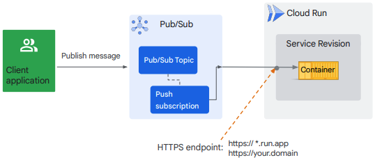

#### Pub/Sub integration
1. Create a Pub/Sub topic.
2. Add code in your Cloud Run service to respond to the Pub/Sub messages sent to the topic that you created.
    - Your service must extract the message from the request and return an expected HTTP status response code.
    - Success codes, such as HTTP 200 or 204, acknowledge complete processing of the Pub/Sub message.
    - Error codes, such as HTTP 400 or 500, indicate that the message will be retried.
3. Create a service account with the required permission (role: Cloud Run Invoker) to invoke your Cloud Run service.
4. Create a Pub/Sub push subscription for the topic that you created, and associate it with the service account. Provide your service’s URL as the endpoint URL. This subscription will send any message that is published to the topic to your service.

### Cloud SQL
#### Connect Cloud Run to Cloud SQL
Cloud SQL is a fully-managed database service for MySQL, PostgreSQL, and SQL Server that lets you set up, manage, and administer relational databases in Google Cloud.

By default, Cloud SQL assigns a public IP address when you create a new instance. To connect to the instance from your Cloud Run service:
- The service account used by the service must have the appropriate Cloud SQL roles and permissions. (one of Cloud SQL Client, Cloud SQL Admin)
- Deploy or update your Cloud Run service with the instance connection name of your Cloud SQL instance. You can do this in the Google Cloud console, with the gcloud CLI, or with Terraform.

```
gcloud run services update my-service –-add-cloudsql-instances=my-sql-instance-connection
```
You also have the option to assign a private IP address to your Cloud SQL instance. With a private IP address, you can route all egress traffic from your Cloud Run service to the Cloud SQL instance using a Serverless VPC Access connector. To do this, you configure your Cloud Run service to use the connector when you deploy or update the service.

#### Connecting to Cloud SQL from your application
When connecting to a Cloud SQL instance with a private IP address, your application will connect directly through Serverless VPC Access.

For the public IP path, Cloud Run provides encryption and connects using the Cloud SQL Auth proxy using network sockets or a Cloud SQL connector. Cloud SQL connectors are language specific libraries that provide encryption and IAM-based authorization when connecting to a Cloud SQL instance. Your application code will need access to the Cloud SQL instance connection name, database name, and credentials. It’s recommended to use Secret Manager to store the sensitive database credentials, and pass this information to your application as environment variables or mounted as a volume in Cloud Run.

You should also use a client library that supports connection pools that automatically reconnect broken client connections to the Cloud SQL database. By using a connection pool, you can also limit the maximum number of connections used by the service. Cloud Run services are limited to 100 connections per service to a Cloud SQL database. There are also quotas and limits imposed by Cloud SQL.

