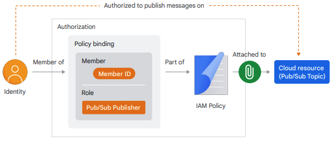

◀️ [Home](../../../../README.md)

# Introduction
Cloud Run provides fully-managed compute to run containers, simplifying running containerized workloads and abstracting away infrastructure management. 
1. Write code using a language of your choice, 
2. package your code as a container, 
3. and run gcloud run deploy to launch your application with Cloud Run. 

## Learning Objectives
1. Understand the fundamentals of Cloud Run including the resource model, container lifecycle, and autoscaling.
2. Develop and test applications locally before deploying to Cloud Run.
3. Use service identity and IAM with Cloud Run.
4. Integrate Cloud Run applications with Google Cloud services.

# Fundamentals of Cloud Run
## Overview
Cloud Run is a fully managed compute platform that lets you deploy and run containers directly on top of Google's infrastructure. If you can build a container image of your application code written in any language, you can deploy the application on Cloud Run. Cloud Run works well with other services on Google Cloud. You can build full-featured applications without spending too much time operating, configuring, and scaling your Cloud Run service.

On Cloud Run, your code can either run continuously as a service or as a job. Both services and jobs run in the same environment and can use the same integrations with other services on Google Cloud.
- Cloud Run services are used to run code that responds to web requests, or events.
- Cloud Run jobs are used to run code that performs work (a job) and quits when the work is done

A Cloud Run service provides you with the infrastructure required to run a reliable HTTPS endpoint. Your responsibility is to make sure your code listens on a TCP port and handles HTTP requests. Cloud Run supports secure HTTPS requests to your application, and:
- Provisions a valid TLS certificate, and an HTTPS endpoint to support HTTPS requests. The endpoint is on a unique subdomain of the *.run.app domain. If necessary, you can configure a custom domain for your service.
- Handles incoming requests, decrypts, and forwards them to your application.
- Supports WebSockets, HTTP/2, and gRPC.

### Cloud Run jobs
If your code performs work, and then stops (a script is a good example), you can use Cloud Run to run your code as a job. You can execute a job from the command line using the gcloud CLI, schedule a recurring job, or run it as part of a workflow. A job can start a single container instance or multiple container instances to run your application code or job script. With multiple container instances running in parallel, the job can complete the task faster. Jobs that run multiple identical container instances are known as Array jobs. For example, you can use an Array job to process multiple image files from Cloud Storage at the same time with multiple container instances.

### Running containers
For your service or job to be deployable to Cloud Run, you must package it in a container image. Running containers is a major advantage of Cloud Run. This means that you can develop your applications in any programming language and run them on Cloud Run, as long as they can be compiled to a 64-bit Linux binary and packaged in a container image.

### Features and benefits
Cloud Run supports various features which include:
- Every Cloud Run service is provided with an HTTPS endpoint on a unique subdomain of the *.run.app domain. You can configure custom domains as well.
- Cloud Run is built to rapidly scale out to handle all incoming requests. A service can rapidly scale up to 1000 container instances. If demand decreases, Cloud Run removes idle containers.
- Every deployment creates a new immutable revision. You can route incoming traffic to the latest revision or roll back to a previous revision. To perform a gradual rollout, you can also split traffic between multiple revisions at the same time.
- A Cloud Run service can be reachable from the internet, or you can restrict access. We discuss access control later in this course.
- Cloud Run container instances can reach resources in the Virtual Private Cloud (VPC) network through the Serverless VPC Access connector.

Some benefits of using Cloud Run are:
- Cloud Run integrates with the broader ecosystem of Google Cloud, which enables you to build full-featured applications. You can use:
    - Data storage services such as Cloud SQL, Cloud Storage, Firestore, and others.
    - Cloud Logging for log ingestion and error reporting.
    - Identity and Access Management (IAM) for service identification and authentication.
- Cloud Run is serverless so you don’t have to worry about infrastructure provisioning and management.
- Cloud Run supports continuous integration and delivery with source code repositories such as GitHub, Bitbucket, or Cloud Source Repositories.
- Pay-per-use pricing for services

### Invoking Cloud Run
A Cloud Run service can be invoked in the following ways:

**HTTPS**: You can send HTTPS requests to trigger a Cloud Run service at a stable HTTPS URL. Some use cases include:
- Custom RESTful web API
- Private microservice
- HTTP middleware or reverse proxy for your web applications
- Prepackaged web application

**gRPC**: You can use gRPC to connect Cloud Run services with other services—for example, to provide simple, high-performance communication between internal
microservices. gRPC is a good option when you:
- Want to communicate between internal microservices.
- Support high data loads (gRPC uses protocol buffers, which are up to seven times faster than REST calls).
- Need only a simple service definition and you don't want to write a full client library.
- Use streaming gRPCs in your gRPC server to build more responsive applications and APIs.

**WebSockets**: WebSockets applications are supported on Cloud Run with no additional configuration required.

**Trigger from Pub/Sub**: You can use Pub/Sub to push messages to the endpoint of your Cloud Run service, where the messages are then delivered to containers as HTTP requests. Possible use cases include:
- Transforming data after receiving an event upon a file upload to a Cloud Storage bucket.
- Processing your Google Cloud operations suite logs with Cloud Run by exporting them to Pub/Sub.
- Publishing and processing your own custom events from your Cloud Run services.

**Running services on a schedule**: You can use Cloud Scheduler to securely trigger a Cloud Run service on a schedule. This is similar to using cron jobs. Use cases include:
- Performing backups regularly.
- Performing recurrent administration tasks, such as regenerating a sitemap or deleting old data, content, configurations, synchronizations, or revisions.
- Generating bills or other documents.

**Executing asynchronous tasks**: You can use Cloud Tasks to securely schedule a task to be asynchronously processed by a Cloud Run service. Events from Eventarc: You can trigger Cloud Run with events from various Google Cloud sources. For example, you can:
- Use a Cloud Storage event (through Cloud Audit Logs) to trigger a data processing pipeline.
- Use a BigQuery event (through Cloud Audit Logs) to initiate downstream processing in Cloud Run each time a job is completed.

## Resource model
### Cloud Run services
The service is the main resource of Cloud Run. Each service is located in a specific Google Cloud region where Cloud Run is available. Services are a regional resource and container instances of a service can start in any zone in the region. For redundancy, services with high traffic and many container instances are spread out over multiple zones in the region. This means that if Cloud Run is experiencing issues in one zone, your service will continue to serve requests. A given Google Cloud project can run many services in different regions. Each service exposes a unique endpoint and automatically scales the underlying infrastructure to handle incoming requests.

### Cloud Run revisions
Each deployment of your application container image to Cloud Run creates a service revision. A revision consists of a specific container image, along with environment settings such as environment variables, memory limits, or concurrency value. Revisions are immutable. Once a revision has been created, it cannot be modified. For example, when you deploy a container image to a new Cloud Run service, the first revision is created. If you then modify your application code and deploy a different container image to that same service, a second revision is created. Requests to your application are automatically routed as soon as possible to the latest healthy service revision.

Each service revision that receives requests is automatically scaled with the number of container instances needed to handle all these requests. A container instance can receive many requests at the same time. With the concurrency setting, you can set the maximum number of requests that can be sent in parallel to a given container instance.

### Cloud Run jobs
Each job is located in a specific Google Cloud region. A job consists of one or multiple independent tasks that are executed in parallel in a given job execution. Each task runs one container instance. When a job is executed, a job execution is created in which all job tasks are started. All tasks in a job execution must complete successfully for the job execution to be successful. To handle task failures, you can set timeouts on tasks and specify the number of retries.

### Regions and zones
Cloud Run is a regional service that lets you choose a region where your containers are deployed. A region is a specific geographical location where your Google Cloud resources are hosted. A region consists of three or more zones. Zones and regions are logical abstractions of underlying physical resources that are provided in one or more data centers. An example of a region is us-central1 in Iowa, North America. A zone is a deployment area for cloud resources within a region. Zones are considered to single failure domains within a region. For high availability, Cloud Run distributes your containers over multiple zones in a region, making your application resilient against the failure of a zone.

## Container lifecycle
### Creating a Cloud Run service
When you deploy a container image for the first time to Cloud Run, a service, and its first revision is created. You can deploy a container image from the Google Cloud console, the gcloud CLI, or from a YAML configuration file. Each service has a unique and permanent HTTPS endpoint URL that does not change over time. In Cloud Run, you interact primarily with a service resource to perform tasks such as deploying a new container image, rolling back to a previously deployed revision, and changing configuration settings such as environment variables and scaling.

### Handling requests to a service
The service HTTPS endpoint is on a subdomain of the run.app domain. To handle requests that are sent to the service endpoint URL, Cloud Run starts a container and forwards the requests to the container.

### Container lifecycle
The relevant states of a container are:

#### Starting
The starting state is when Cloud Run materializes the container image and starts your application. Begins when Cloud Run pulls a container image, and ends when the container starts to serve requests. Starting a container requires four steps:

1. Cloud Run creates the container’s root file system by materializing the container image.
2. Once the container file system is ready, Cloud Run runs the entrypoint program of the container (your application).
3. While your application is starting, Cloud Run continuously probes port 8080 to check whether your application is ready. (You can change the port number if you need to.)
- You can configure HTTP, TCP, and gRPC startup health check and liveness probes for new and existing Cloud Run services using a YAML file.
- A startup probe can be used to determine when a container has started and is ready to accept traffic. For more information on setting up these types of probes, view the documentation on container health checks.
4. Once your application starts accepting TCP connections, Cloud Run forwards incoming web requests to your container. Make sure that your application only opens the port when it’s ready to handle requests.

Cloud Run pulls container images from internal storage. However, there are two distinct events when Cloud Run pulls a container image. And there are two different sources Cloud Run can pull from.
- The first is when you **deploy** a container image for the first time.
- The second is when Cloud Run **starts a new container**.

When you **deploy** a new container image, Cloud Run pulls and copies the container image from Artifact Registry. Cloud Run then stores the image in its internal storage, and every time it **starts** a new container, it pulls the container image from there. This internal storage is optimized to make sure that large container images load just as fast as tiny ones. Because Cloud Run copies the container images, it also insulates your service from failures in Artifact Registry, or when you accidentally remove a deployed container image from Artifact Registry.

#### Serving requests
This is when your container is handling web requests.

#### Idle
The container is idle when it is not handling web requests. If a container handles no requests for 100 ms, the container transitions into the idle state.

An idle container does not incur costs, which means you’re not charged. Idle containers on Cloud Run have these limitations:
- Cloud Run throttles the CPU of an idle container to nearly zero, which means that your application will run very slowly. You can change this behavior so CPU is always allocated and available even when there are no incoming requests. Setting the CPU to be always allocated can be useful for running short-lived background tasks and other asynchronous processing tasks. If you choose the CPU always allocated setting, you are charged for the entire lifecycle of the container instance.
- When your container’s CPU is throttled, you can’t reliably perform background tasks on your container. To schedule tasks on Cloud Run, you can use Cloud Tasks.
- Network requests to third parties are likely to fail while the container is idle.
- An idle container can be shut down at any time. You do, however, have a lifecycle hook you can use to shut down gracefully

Containers can go from idle to serving requests and back again many times. When a container handles a request after being idle, the container goes from the idle state to serving requests. During this state transition, Cloud Run will unthrottle the container’s CPU, and return full access to the container immediately. Your application, and users won’t notice any lag. To handle traffic spikes and minimize cold starts, Cloud Run may keep some instances idle for a maximum of 15 minutes. The minimum instances setting ensures that Cloud Run always keeps a certain number of container instances ready to serve requests.

#### Shutting down
If you handle the shutdown hook, Cloud Run lets you stop your application gracefully.

If your container is idle, Cloud Run can decide to stop it. By default, a container just disappears when it’s shut down. However, you can build your application to handle a SIGTERM signal. The SIGTERM signal warns your application that shutdown is imminent. That gives the application 10 seconds to clean up things before the container is removed, such as closing database connections or flushing buffers with data.

Stopping gracefully allows your application time to clean up. Examples of things your application can do are:
- Close open TCP connections, file descriptors, and database connections. Most downstream systems are slow to time out idling connections, If your application experiences much scaling up and down, you might hit maximum connection errors if you don’t close connections.
- Flush any buffers that you have with data, such as telemetry data, or any other data that you batch before sending.
- Finally, it’s useful to write a log that’ll help with debugging later. Most programming languages provide libraries to trap termination signals like SIGTERM and run routines before your application terminates.

#### Stopped
The final state in the lifecycle is when the container is stopped.

If your application does not handle the SIGTERM signal, Cloud Run immediately stops the container. In this case, the process just stops and disappears.

Cloud Run never stops a container while it serves requests under normal circumstances. However, a container can stop suddenly:
- If your application exits (for instance due to an error in your application code), or
- If the container exceeds the memory limit. By default, the memory allocated to each container instance of a revision or job is 512 MiB.

If a container stops while it’s handling requests, all in-flight requests are terminated and fail with an error. While Cloud Run starts a replacement container, new requests might have to wait. To avoid running out of memory, you can configure memory limits. By default, a container is allocated 512 MiB of memory on Cloud Run, but you can increase the allocation to 32 GiB.

> [Lifecycle of a container on Cloud Run](https://cloud.google.com/blog/topics/developers-practitioners/lifecycle-container-cloud-run)

## Autoscaling
### Automatic scaling with Cloud Run
To maintain the capacity to handle incoming requests to your service, Cloud Run automatically increases the number of container instances of a service revision when necessary. This feature is known as autoscaling. Requests to a service revision are distributed by an internal load balancer across the group of container instances.
- If all container instances are busy, Cloud Run adds additional instances.
- When demand decreases, Cloud Run stops sending traffic to some instances and shuts them down.
- A container instance can receive many requests at the same time. With the concurrency setting, you can set the maximum number of requests that can be sent in parallel to a given container instance. In addition to the rate of incoming requests to your service, the number of container instances is affected by:
- The CPU utilization of existing instances when they are processing requests (with a target of 60% of utilization).
- The maximum concurrency setting.
- The minimum and maximum number of container instances setting.
    - The number of container instances in a Cloud Run service is limited to 1,000 instances by default. If you need more, you can submit a request for a quota increase.

### Scale to zero
If there are no incoming requests to your service, even the last remaining container instance will be shut down. This is commonly referred to as scale to zero. This feature is attractive for economic reasons because you don’t pay for container instances that are idling. A new container instance will start on demand when a new request is sent to your service. To reduce the latency of your service when there are no instances, you can configure Cloud Run to keep a minimum number of container instances active. 

### Request queuing
The first few requests that come in after your service scaled to zero will queue while the first container instance starts. This is known as a ‘cold start’. To reduce the latency of your service, you can configure Cloud Run to keep a minimum number of container instances idle. These instances will be ready to process requests when they are received.

### Minimum instances
To change the default ‘scale to zero’ behavior, you specify a minimum number of container instances to be kept warm and ready to serve requests. With minimum instances set, Cloud Run keeps at least the number of minimum instances running, even if they're not serving requests (idle). As your service receives requests, the number of active instances might increase and the number of idle instances decrease. Idle instances that are kept running using the minimum instances feature incur billing costs.

### Maximum instances
If you deploy a service that scales up to many container instances, you will incur costs for running those containers. If your Cloud Run service scales up to many container instances in a short time period, your downstream systems might not be able to handle the additional traffic load. You’ll need to understand the throughput capacity of those downstream systems when configuring your Cloud Run service. For example, your Cloud Run service might interact with a database that can only handle a certain number of concurrent open connections. To limit the total number of container instances that can be started, for cost control reasons, or for better compatibility with other resources used by your service, use the maximum container instances setting for your service revision. Be aware that setting maximum instances too low affects the ability of Cloud Run to scale up to serve all incoming requests. By default, Cloud Run services are configured to scale out to a maximum of 100 instances. You can set or update the maximum instances configuration for your service in the Google Cloud console, using the gcloud CLI, a YAML configuration file, or Terraform.

### Maximum concurrency
As previously mentioned, each service revision is automatically scaled to the number of container instances needed to handle all incoming requests. When more container instances are processing requests, more CPU and memory will be used, resulting in higher costs. To give you more control, Cloud Run provides a maximum concurrent requests per instance setting, that specifies the maximum number of requests that can be processed simultaneously by a given container instance. Cloud Run automatically adjusts the concurrency up to the configured maximum. By default, each Cloud Run container instance can receive up to 80 requests at the same time; you can increase this to a maximum of 1000. Consider setting the maximum concurrency to 1 if:
- Each request uses most of the available container CPU or memory.
- You application code is not designed to handle multiple requests at the same time.
- Your application code relies on global states that cannot be shared by multiple requests.

If your container cannot process many requests concurrently, you should consider lowering the maximum concurrency setting. The number of concurrent requests that each container instance can serve can be limited by the technology stack, and the use of shared resources such as variables and database connections. Setting a higher maximum concurrency could have an  effect on downstream services when there are traffic spikes to your service. Also, as each request to your service requires some amount of additional memory, a high maximum concurrency setting could increase the overall memory requirement of your container. You can set or update the maximum concurrency configuration for your service in the Google Cloud console, using the gcloud CLI, a YAML configuration file, or Terraform. Configure your service with an optimal concurrency configuration to maintain stability under expected load. You can achieve this by load testing your application with tools that support configurable concurrency configuration.

## Access control with IAM
One way to look at **Google Cloud** is that it’s a **collection of APIs that lets you create and manage virtual resources**, like virtual machines, Cloud Run services, load balancers, or a Pub/Sub topic and a database table on a Cloud SQL database server. To manage your infrastructure, you interact with these APIs with:
- The web console from a browser.
- The gcloud CLI.
- Terraform (a third party application that lets you practice infrastructure as code).
- Client libraries from your application code.

As an example, **deploying a container image to Cloud Run is an API call**. When you run the gcloud run deploy command on your local machine using the gcloud CLI, an API call is made to the Cloud Run service on run.googleapis.com to deploy the container image.

### IAM authorizes API calls
Identity and Access Management (IAM) is a Google Cloud service that lets you create and manage permissions for Google Cloud resources. IAM verifies the identity of the caller, and checks if it has permissions to perform the API call. If that check fails, it rejects the call. It’s important to note that IAM works the same way, regardless if you’re deploying a new revision of a Cloud Run application (API call), or if your application code publishes a message to Pub/Sub using Google Cloud APIs. In both examples, IAM performs the authorization of the API calls. 

### IAM policy
To check if you’re authorized to perform certain actions on Google Cloud resources, IAM uses policies. For example, to publish a message to a Pub/Sub topic, IAM checks an IAM policy that is attached to the Pub/Sub topic. If that policy has a binding that allows you to publish the message, IAM lets the call through.

**An IAM Policy is a list of policy bindings. A policy binding binds a member (identity) to a single role**. In the example, if you have the role “Pub/Sub Publisher”, you’re allowed to send messages to the Pub/Sub topic that the IAM policy is attached to. A member can have multiple policy bindings in an IAM policy enabling that member to have more than one role. A role contains a set of permissions that allows the member identity to perform specific actions on Google Cloud resources. In the example, the Pub/Sub Publisher role includes the pubsub.topics.publish permission that provides access to publish messages to a topic.

### IAM authorization
Now, let’s bring everything together. An IAM policy is always attached to a resource. In this example, you’re authorized to publish messages to the topic because:
1. You’re a member of a policy binding.
2. The binding has the role Pub/Sub Publisher.
3. The binding is part of an IAM Policy, which is attached to the topic. Another way to say this is that the policy binding in the IAM policy grants you the permission to publish messages to a specific topic. 

### Making a Cloud Run service public
To make a Cloud Run service publicly accessible, you can allow unauthenticated invocations to the service. You do this by assigning the IAM Cloud Run Invoker role to the allUsers member type on the service. To configure authentication by assigning this role, you must have the required permission which is included in the project Owner and Cloud Run Admin roles. You can also use the `–allow-unauthenticated` option with the gcloud run deploy command when you deploy your service.

### Controlling access to services and jobs
You can add individual users or principals (identities) to a Cloud Run service or job with the desired roles and permissions in the Google Cloud console, or with the `gcloud run [services | jobs] add-iam-policy-binding` command. For example, to invoke a Cloud Run service with a service account, you can grant the invoke permission to the member account with this gcloud CLI command: `gcloud run services add-iam-policy-binding my-service –-member=serviceAccount:sa_email –-role=roles/run.invoker` To remove principals from a role for a service or job, use the console or the `gcloud run [services | jobs] remove-iam-policy-binding` command. To grant access to principals on all services and jobs in a project, you can use project-level IAM with the `gcloud projects add-iam-policy-binding` command.

### Controlling network access
In addition to the IAM authentication methods discussed previously, network ingress settings is another way to manage access to a service. These methods are independent of each other, but for a layered approach to managing access, you can use both. To control network access to your service, Cloud Run provides three ingress settings at the service level:

- All - This is the least restrictive default setting, that allows all requests including those sent directly from the internet to the default run.app URL or custom domain of your service.
- Internal - This is the most restrictive setting, that only allows requests from:
    - Internal HTTP(S) load balancer
    - Resources that are allowed by any VPC Service Controls perimeter that contains your Cloud Run service. VPC Service Controls is a Google Cloud feature that lets you set up a secure perimeter to guard against data exfiltration. Both the default run.app URL and custom domains are subject to VPC Service Controls.
    - VPC networks in the same project or VPC Service Controls perimeter as your Cloud Run service.
    - Google Cloud services: Cloud Tasks, Eventarc, Pub/Sub, and Workflows if they are in the same project or VPC SC perimeter as your Cloud Run service. Requests from these sources stay within the Google network, even if they access your service at the run.app URL.
 Requests from other sources, including the internet, cannot reach your
service at the run.app URL or custom domains.
- Internal and Cloud Load Balancing - allows requests from:
    - Resources that are allowed by the more restrictive Internal setting.
    - External HTTP(S) load balancer, but not directly from the internet.

### Connecting to a VPC network
A Virtual Private Cloud (VPC) network is a virtual version of a physical network, implemented inside Google's production network. It’s a global resource that consists of a list of regional virtual subnetworks (subnets) in data centers, all connected by a global wide area network. 

To connect a Cloud Run service or job directly to your VPC network to access VM instances, Memorystore instances, and other resources with an internal IP address, use [Serverless VPC Access](https://cloud.google.com/vpc/docs/serverless-vpc-access). With Serverless VPC Access, you can send requests and receive responses to and from your VPC network using internal DNS and internal IP addresses, so that traffic is not exposed to the internet.

### Configuring Serverless VPC Access
A Serverless VPC Access connector is a resource that handles traffic between your Cloud Run service or job and your VPC network. The region that is configured for the connector must match the region where your service or job is deployed. Configure the connector with an unused /28 subnet or non-overlapping /28 CIDR range. The subnet or CIDR range must be used exclusively by the connector and no other resources. You can create a connector in the Google Cloud console, with the Google Cloud CLI, or with Terraform. 

After you have created a Serverless VPC Access connector, you must configure your Cloud Run service or job to use the connector. You can do this in the Google Cloud console, with the Google Cloud CLI, YAML file, or Terraform, when you create the service or deploy a new revision. Similarly, you must configure your Cloud Run job to use the connector when the job is created. For an internal Cloud Run service, you should set all egress from the service to use the VPC connector. You can also restrict your connector’s access to the resources in your VPC network with firewall rules.