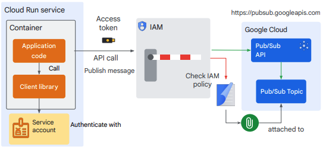

◀️ [Home](../../../../README.md)

# Service Identity and Authentication
## Service accounts and identity
To interact with these service APIs, you can use the gcloud CLI, the web console, aclient library, or use any other process that calls the API, like Terraform. 


Here’s another example API call from an application using a client library.


Pub/Sub is a message broker service on Google Cloud that you can use to send messages between services asynchronously. To publish a message to Pub/Sub from a Python application, you would use the pubsub client library as shown in the sample code. The client library handles the API call to pubsub.googleapis.com.


In this example, the application code uses the pubsub client library to send an API call to pubsub.googleapis.com. IAM will inspect the request and identify your application by the credentials in the API request. Now that IAM has the identity, it will need to figure out what operations are allowed for the identity to perform on the Pub/Sub topic. IAM does this by checking policy bindings in an IAM policy that you attach to the Pub/Sub topic.

### Policy binding
A policy binding binds one or more members (identities) to a single role. A role contains a set of permissions that allows the member identity to perform specific actions on Google Cloud resources. For example, the Pub/Sub Publisher role includes the pubsub.topics.publish permission that provides access to publish messages to a topic. IAM supports the following types of identities:
- Human identities: Your Google account is a human identity which you use to sign in to GoogleCloud. Your Google Account can also be part of a group or a domain.
- Service account: Used by machines or applications. Examples of machines with a serviceidentity are a virtual machine, a Cloud Run service, a Cloud Function, or otherservices.
- All users: A special identifier to allow everyone or allow public access to a service onGoogle Cloud.A member can be attached to multiple policy bindings in an IAM policy enabling thatmember to have more than one role.

### Service account
Just like your Google Account is your identity from the point of view of IAM, a Cloud Run service also has its own identity, called a service account. **A service account is a special type of account used by machines, applications, or services. It’s identified by its email address, which is unique to the account.** Service accounts differ from user accounts in a few key ways:
- Service accounts do not have passwords, and cannot sign in by using browsers or cookies.
- You can let other users or service accounts act on behalf of a service account.
- Service accounts are not members of your Google Workspace domain, unlike user accounts, although you can add them to groups.

#### Service account usage
Service accounts are meant to be used by machines. If you run code somewhere, for example on a virtual machine, in a Cloud Run service, or as part of a build in Cloud Build, you have access to a built-in service account. If you use one of the client libraries to connect to Google Cloud APIs, the libraries will automatically use this built-in service account for authentication. You can always replace the service account with your own user-managed service account, which is recommended.

#### Service accounts in Cloud Run
Every Cloud Run service or job is linked to a service account, that is also known as the “service identity.” By default, Cloud Run services or jobs run as the default Compute Engine service account with the Editor role. It’s recommended to use a user-managed service account with the most minimal set of permissions required for the service to perform its functions. A best practice is to use a service account for each service identity, and grant selective permissions to the account.

### Service identity on Cloud Run
In practice, a container with your application runs as part of a Cloud Run service.



If you use a client library in your application code to publish a message to a Pub/Sub topic, the library automatically acquires appropriate tokens to authenticate your code's requests using the service's runtime service account. When accessing most Google APIs, OAuth 2.0 access tokens are used. The access token is used to call the Pub/Sub API. IAM verifies the access token, and uses the identity in the access token to check if there is a policy binding with the required roles to publish a message to the attached Pub/Sub topic.

### Service to service communication
If your application architecture uses multiple Cloud Run services, these services likely need to communicate with each other. This communication could be either asynchronous or synchronous. Many of these services may be private and therefore require credentials for access. For asynchronous communication, you can use various Google Cloud services such as Cloud Tasks, Pub/Sub, Cloud Scheduler, or Eventarc. For synchronous communication, your service calls another service’s endpoint URL directly over HTTP. In this case, it’s a best practice to use IAM and an individual service identity for the calling service. The service account is granted the minimum set of permissions required. To set up a service account, you configure the receiving service to accept requests from the calling service by making the calling service's service account a principal on the receiving service. Then you grant that service account the Cloud Run Invoker (roles/run.invoker) role. 

```
gcloud run services add-iam-policy-binding RECEIVING_SERVICE --member='serviceAccount:CALLING_SERVICE_IDENTITY' --role='roles/run.invoker
```

The request made by the calling service must present proof of this identity in the form of a Google-signed Open ID Connect token. OpenID Connect is an identity protocol based on OAuth 2.0 that enables identity verification of a client based on the authentication performed by an authorization server. It’s also used to obtain basic profile information about the client. One way to acquire this ID token is to use the Google authentication client libraries in your calling service’s application code. In the receiving service, your application code can use Google’s authentication libraries to parse the request, and extract and verify information from the ID token.

## Resource Hierarchy
Google Cloud resources are organized hierarchically. A Google Cloud project is your primary means to organize resources, where every resource needs to be in a project. A cloud resource can be, for example, a Cloud Tasks Queue, a Cloud Run service, or a Compute Engine virtual machine.


The organization resource is the root node of the resource hierarchy. It provides central visibility and control over every other resource that belongs to the organization. An additional and optional grouping mechanism under the organization node is the folder. Folders can be mapped to departments, teams, or business units within an organization. The project is the base-level entity for organizing resources. It’s required to create resources, use Cloud APIs and services, manage permissions, and enable billing among other things. You can organize projects into folders. Each resource has exactly one parent (except for the top organization node which has none).

### Resource permissions
Every resource in the hierarchy has an IAM Policy, and you can grant permissions on it using policy bindings. A policy binding binds an identity to a role and grants permissions to that identity on that resource.


If you think back to the example of publishing a message to a Pub/Sub topic - what was the role you needed? “Pub/Sub Publisher”. 

### Policy binding inheritance
How useful would it be to add that policy binding to a project, instead of to an individual Pub/Sub topic? It turns out that that is very useful, because if you add a policy binding to a higher level resource, it’s inherited by lower level resources.

When IAM evaluates access to a resource, it evaluates policy bindings from the parent resource (and their parent) as well. The effective IAM policy on the resource includes those bindings that are granted to a parent which you cannot take away.

## Principle of least privilege
### Types of IAM roles
There are three types of roles in IAM:
- Basic roles include the Owner, Editor, and Viewer roles. These roles include many permissions across all Google Cloud services. Do not grant these roles by default in production environments. Instead, grant the most limited predefined or custom roles that meet your needs.
- Predefined roles, which provide granular access to a specific resource, and are managed by Google Cloud.
- Custom roles, which provide granular access according to a user-specified list of permissions.

### Default service account in Cloud Run
As previously mentioned, if you deploy a Cloud Run service and do not specify a service account, a default service account is used. The default service account used is the Compute Engine service account which has the broad Editor role on the project. Because of policy binding inheritance, the default service account has read and write permissions on most resources in your project. While convenient, it’s an inherent security risk as resources can be created, modified, or deleted with this service account.

### Use the principle of least privilege
To mitigate this security risk, you should:
1. Create a new service account for a Cloud Run service.
2. Configure the service account as the Cloud Run service’s identity.
3. Add policy bindings for this identity with predefined or custom roles on resources that your service needs to access.

#### Create a new service account
The first step is to create a new user-managed service account for a Cloud Run service, and set it as the service identity of the service. You can create a service account in the Google Cloud console or with the gcloud CLI. You can set the service account for a Cloud Run service when you create or update a service, and when you deploy a new service revision. This can be done in the Google Cloud console, the gcloud CLI, a YAML file, or with Terraform.

#### Add policy bindings with predefined roles
By default, this service account does not have any permissions. You’ve just created it, and it doesn’t appear in any policy binding. If you call any Google Cloud API from code that runs as part of the Cloud Run service, the call will be rejected by IAM. To grant the service account permissions, you add a policy binding with the appropriate role for the service account member, to the IAM policy that is attached to the required resource. For example, to enable your Cloud Run service to publish a message to a Pub/Sub topic, add a policy binding with the role Pub/Sub Publisher to the IAM policy that’s attached to the topic. 

## Secrets and environment variables
### Environment variables in Cloud Run
Environment variables are key-value pairs that can be used by your service’s application code to control functionality. When you set environment variables in Cloud Run, they are injected into your application container and are made accessible to your code. There are certain reserved environment variables that cannot be set. A list of these variables is documented in the [container runtime contract](https://cloud.google.com/run/docs/container-contract#env-vars). You can set environment variables when creating or updating a service or job, or when deploying a new service revision. You can set default environment variables in the container with the ENV statement in a Dockerfile. An environment variable set with the same name on a Cloud Run service or job overrides the value set in the default variable.

To access environment variables in your application code, you use the appropriate functions in library modules that are available for your programming language. For example, to access environment variables in your code that is written in Python, use the environ.get function in the os module `os.environ.get(“key”)`. For Node.js, use process.env, and for Java use System.getenv().

### Using secrets in Cloud Run
Your service or job might need to access downstream services that require sensitive configuration such as API keys, passwords, or other information. For Cloud Run services, it’s recommended to store this type of sensitive information in a secret that is created in Secret Manager. Secret Manager is a Google Cloud service that lets you store, manage, and access secrets. A secret is an object that contains a collection of metadata like replication locations, labels, permissions, and other information; and secret versions. A secret version stores the actual secret data such as an API key or password as a text string or binary blob.

You can make a secret accessible to your service or job running in Cloud Run in either of two ways:
- Mount the secret as a volume, which makes the secret available to the container as a file. Reading a volume always fetches the secret value from Secret Manager, so it can be used with the latest version.
- Pass a secret to your Cloud Run service as an environment variable. Environment variables are resolved at instance startup time, so if you use this method, it’s recommended that you pin the secret to a particular version rather than using latest. You can make a secret accessible to your service when deploying it to Cloud Run. You can update existing secrets by deploying a new revision or updating the service. You can do this in the Google Cloud console, with the gcloud CLI, or using a YAML file. Any configuration change such as updating secrets leads to the creation of a new service revision. Subsequent revisions will also automatically get this configuration setting.

To allow a Cloud Run service to access a secret, you must grant the Secret Manager Secret Accessor role to the Cloud Run service account.
```
gcloud secrets add-iam-policy-binding my-secret-id \
–-member="my-service-account-email" –-role="roles/secretmanager.secretAccessor"
```