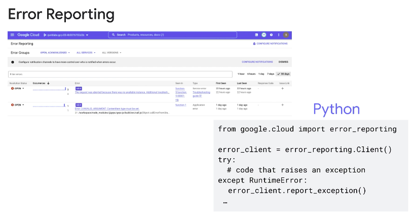

◀️ [Home](../../../../README.md)

## Best Practices for Functions

### Best practices implementing functions
#### Writing function
- Write your functions to be idempotent so that they produce the same result when called multiple times. This lets you retry a function invocation if the previous invocation partially fails for some reason.
- An HTTP function must always return an HTTP response, otherwise the function may continue executing until timeout and incur charges for the entire time till then.
- You should not have any activities running in the background after your function invocation terminates because the CPU is not accessible and the code will not continue to execute. A subsequent invocation that is executed in the same environment will cause the background activity to resume and interfere with the current invocation that may lead to errors and unexpected behavior.
- When developing functions, you write to files in a temporary directory which is part of an in-memory file system. These files consume memory that is available to your function, and sometimes persist between invocations. To avoid eventually running out of memory and a subsequent cold start of your function, ensure that you explicitly delete any files that are created by your function code.

#### Implementing functions
- To test your function code, you must first deploy it and wait for the deployment to complete and for log entries to become available. Developing and testing your function locally in your development environment makes the development and testing process significantly faster.
- To comply with data locality restrictions in geographical or network boundaries that are not accessible to your functions, you can run your functions on a platform that complies with these restrictions and is compatible with the open source abstraction layers used in Cloud Run functions.
- In languages that support exception handling, do not throw uncaught exceptions because they force cold starts in future function invocations.
- Manually exiting from functions using process.exit() (in Node.js), or using sys.exit() (in Python), may cause unexpected behavior. Instead, return implicitly or explicitly from event-driven functions, and return HTTP responses from HTTP functions.

#### Reporting errors
- You must always handle runtime errors and exceptions in your function code, because exceptions that are not caught may terminate the function and result in cold starts for future invocations.
- Runtime exceptions that are emitted from your function are sent to Error Reporting. You can aggregate and view these errors in the Google Cloud console, be notified when they occur, and take steps to troubleshoot and resolve them as quickly as possible.
- Cloud Run functions includes simple runtime logging by default. Logs written to stdout or stderr will appear automatically in the Google Cloud console.
- HTTP functions should report the error and respond with an appropriate HTTP status code based on the type of error encountered. Event-driven functions should report and return an error message when an exception occurs.

You should report exceptions and errors that may occur during function execution to Google Cloud’s Error Reporting service.

### Improving performance and networking
#### Improving performance
- A cold start creates and initializes the execution environment of a function. During a cold start, any dependencies that your function imports are loaded, adding to the function’s invocation latency. You can reduce this latency and the time needed to deploy your function, by not loading dependencies that your function doesn't use.
- The execution environment of a function's previous invocation is often recycled. If you declare a variable in global scope, its value can be reused in subsequent invocations to a function instance without having to be recomputed resulting in significant performance improvements. You can use this approach to cache objects like API client objects and network connections that may be expensive to recreate on each function invocation.
- Initialization of global variables always increases a function’s latency during cold start invocations. If some of these global variables are not used in all of your function’s code paths, you should consider initializing the variables lazily on demand.
- Function instances are scaled based on the number of incoming requests. By setting a minimum number of function instances to be kept ready to serve requests, you can reduce cold starts of your function and improve your application’s overall performance.

#### Optimizing Networking
- When accessing URLs from your functions, you should create persistent HTTP connections to those URLs.
- By creating persistent connections and caching them in your function’s global scope, you can reduce the CPU time spent to establish a new connection with each function invocation. You can also reduce the likelihood of exhausting your connection quota. Similarly, to avoid unnecessary connections and DNS queries when communicating with Google APIs from your function, create the Google service client object in global scope.
- Use Serverless VPC Access connectors to send requests and receive responses to and from your VPC network using internal DNS and internal IP addresses, so that traffic to internal resources is not exposed to the internet.

### Retrying functions
- Automatic retry is available for event-driven functions only, and is disabled by default.
- You can enable automatic retries for a function with the –retry flag using the gcloud functions deploy CLI command, or select the Retry on failure option in Google Cloud console when you deploy the function. To disable retries, you must redeploy the function without the –retry flag or clear the Retry on failure option in Google Cloud console.

Some reasons for function failure are: 
- A bug causes the runtime to throw an exception that is not handled.
- A service endpoint is not reachable from the function which times out.
- The function code intentionally throws an unhandled exception when certain conditions occur.
- A Node.js function returns a rejected promise or passes a non-null value to a callback.

In these situations, the function stops executing and the event is discarded. With retry enabled, the event is retried repeatedly for up to seven days by default until the function executes successfully, or the maximum retry period has elapsed.

#### Optimizing function retries
- Retries are best used to handle intermittent or transient failures such as failing to connect to a service endpoint or timing out while waiting for the connection to succeed. These kinds of failures have a high likelihood of resolution upon retrying.
- Because your function is retried continuously until successful execution, any bugs that cause function failure should be discovered and fixed in your code through testing before enabling retries.
- Ensure that your function code handles any exceptions that should not result in a function retry.
- When failures are persistent, prevent infinite retry loops by including an end condition in your function before the function processing code executes. One approach is to use timestamps to discard events that are older than a specified time.

### Function configuration
- Following the principle of least privilege, ensure that you limit access to your functions to the minimum number of users and service accounts, and allocate the minimum set of permissions required to develop and use your functions.
- When building services that connect multiple functions, ensure that each function can only send requests to a specific subset of your other functions. For example, a login function should be able to access a user profiles function, but probably not be able to a ccess a search function.
- Unless you specify a different runtime service account when deploying a function, a default service account is used for the function's identity. For production use, you should give each function a dedicated identity by assigning it a user-managed service account. User-managed service accounts let you control access by granting a minimal set of permissions using Identity and Access Management.

You can provision Cloud Run functions with different amounts of **memory** and control the amount of memory a function can use. The amount of allocated memory you choose corresponds to an amount of allocated CPU for your function. To limit the amount of memory allocated to a function, use the –memory flag with the gcloud functions deploy command or use the memory settings in the Google Cloud console.

To prevent your function from **timing out**, specify your function’s timeout duration to be slightly higher than the function’s execution time. Use the –timeout flag with the gcloud functions deploy command or the Timeout settings in Google Cloud console.

By default, function instances handle only one request at a time. You can change this behavior for Cloud Run functions, so that they can handle multiple **concurrent** requests to a single function instance. This helps to reduce overall latency by preventing cold starts as an already warmed instance can process additional requests to the function. To enable concurrency, set a concurrency value per function through the function's underlying Cloud Run service. The concurrency value represents the maximum number of concurrent requests that a single instance of the function can handle. With concurrency enabled, your function code must be safe to execute concurrently as Cloud Run functions does not provide isolation.

### Scaling and traffic splitting
#### Scaling best practices
- Scaling is implemented by creating new instances of your function based on the volume of requests to your function.
- You can control the scaling behavior of your function by setting the minimum and maximum number of function instances during deployment.
- Functions scale independently of each other with each function having its own scaling configuration.

- To avoid cold starts for your application and reduce application latency set a minimum number of instances for your function.
- To limit requests to throughput-constrained downstream resources (for example databases), set the maximum number of instances for your function. To handle spikes in traffic, more than the specified maximum instances might be created for a short period. Also, because instances limits are set for each revision of your function independently, the specified limit might be temporarily exceeded during the period after deployment. This happens so that existing requests are processed uninterrupted by the previous instances, and any new requests are handled by the new instances.

#### Traffic splitting
- Each time you deploy a Cloud Run function, a new revision of the function and the underlying Cloud Run service is automatically created.
- Revisions are immutable and cannot be modified once they are deployed. To change a function, you must redeploy it.
- By default, all traffic to a function is routed to its latest revision. You can change this behavior by setting a custom traffic configuration, enabling you to split traffic between different revisions or roll your function back to a prior revision.

