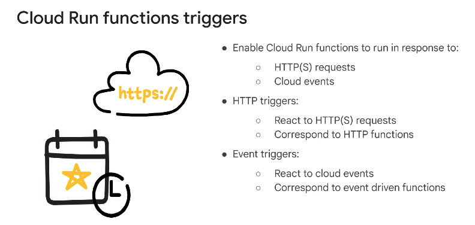
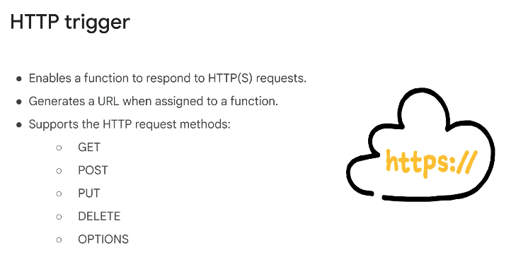
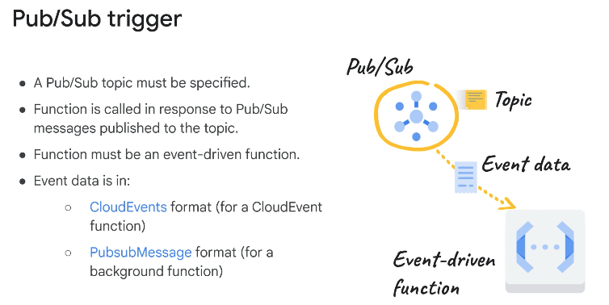
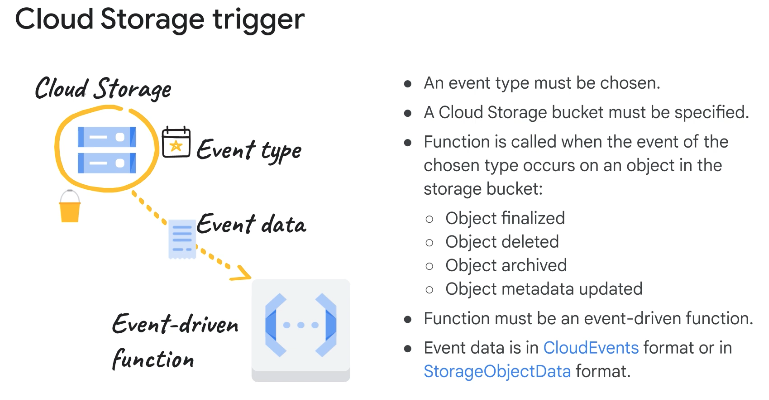
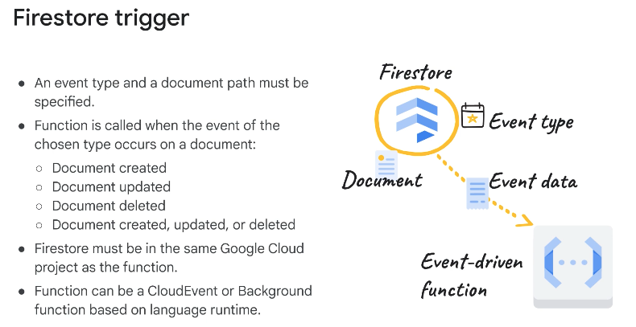
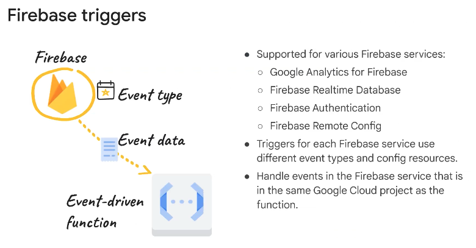
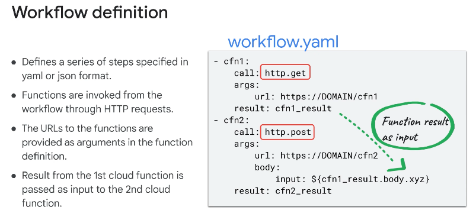

◀️ [Home](../../../../README.md)

## Calling and connecting Cloud Run functions

### Triggering functions

You specify triggers as part of function deployment. You can have the same event cause multiple functions to execute by deploying multiple functions with the same trigger source settings. But, you cannot bind the same function to more than one trigger at a time. All event driven Cloud Run functions use Eventarc for event delivery.

### Connecting Cloud Run functions with workflows
Workflows is a fully-managed, serverless orchestration platform that executes services in an order that you define (a workflow). 
It acts as the central orchestrator for the service orchestration pattern. You design and deploy workflows, which orchestrate and combine Google Cloud services and API calls. To build stateful, automated processes, Workflows can include custom services or functions that are hosted on Cloud Run. A workflow provides a central source-of-truth for the application flow. A workflow can hold state, retry, poll, or wait for up to a year.

You can use Workflows to connect a series of services together that include HTTP services built with Cloud Run functions, external APIs, and other Cloud services like Cloud Run. With this approach, you can create a flexible serverless application.

1. The first step to build a workflow is to enable the required Google APIs for Cloud Run functions, Cloud Run, Workflows, and any other services that you use. You may also need to create any service accounts that are required to access these services.
2. Next, write, and deploy the functions. These functions are HTTP functions with HTTP triggers that generate URL endpoints that are used to invoke the functions. Test the functions individually with `curl` or any other HTTP client. It’s also a best practice to test the functions locally before deployment.
3. You then create the workflow that connects the Cloud Run functions. After the workflow is created, you deploy and execute it.

A workflow is made up of a series of steps that are described using the Workflows syntax. The set of steps is the workflow definition and can be written in either YAML or JSON format.

