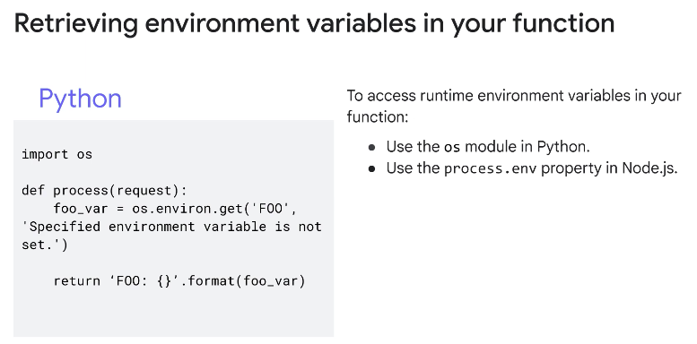
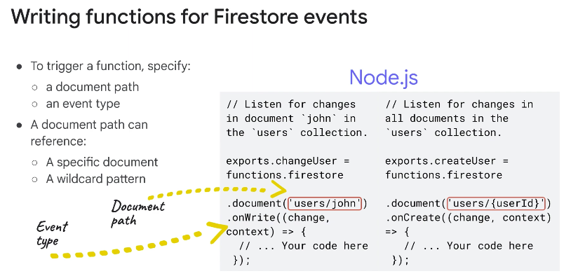
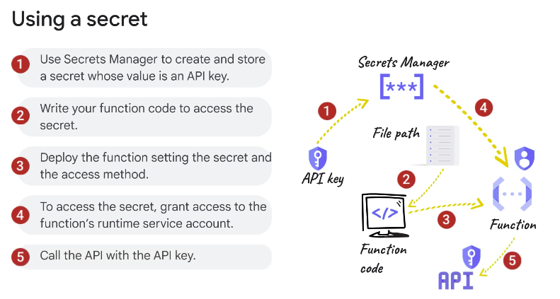

◀️ [Home](../../../../README.md)

## Integrating with Cloud Databases

### Integrating functions with cloud databases
You can integrate Cloud Run functions with: Firestore, Cloud SQL, Spanner, Bigtable, BigQuery, and with Memorystore, Google Cloud’s in-memory cache service.

#### Memorystore
Memorystore is a Google Cloud service that provides a highly available, scalable, and secure in-memory cache solution for Redis and Memcached. It’s a fully managed service that automates provisioning, replication, failover, and patching. It’s also integrated with IAM for secure access, and with Cloud Monitoring for service monitoring and alerting.

Redis is an open source in-memory data structure store used as a database, cache, message broker, and streaming engine. Memcached is an open source distributed memory object caching system.

Cloud Run functions supports the use of environment variables. Environment variables are key-value pairs that can be set for Cloud Run functions at deployment time. The variables are accessed by your function code at runtime, or as configuration information for the buildpack system. They are stored in the Cloud Run functions backend, are bound to a single function, and exist within the same function lifecycle. You can provide the environment variable key-value pairs when you deploy your function with the gcloud CLI or in the Google Cloud console. You can store them in a YAML file in source control and provide the name of the file during function deployment.

#### Firestore
Firestore is a Google Cloud service that provides a fully managed serverless NoSQL document database. It provides high availability, scalability with no maintenance windows or downtime required, and multi-region replication. You store a set of key-value pairs known as a document in Firestore and all documents are stored in collections.

You can extend Firestore’s capabilities with Cloud Run functions by handling events that are triggered by changes in your Firestore database. By implementing function code to handle these events, you can easily add server-side functionality to your application without running your own servers. You can implement your function code to handle Firestore events that occur when a document is created, updated, deleted, or when any of these events occur.

#### Secrets
When your function code needs to access certain databases or APIs, it will need to provide credentials like a database username/password or API key. This kind of sensitive information should be securely stored and accessed by the function when it executes. You can use secrets and Google Cloud’s Secret Manager to store this information.

> A secret is an object that contains a collection of metadata like replication locations, labels, permissions, and other information; and the secret versions. A secret version stores the actual secret data such as an API key or password as a text string or binary blob.

To access a secret, your function must first be granted access to the secret. This is achieved by granting the appropriate role (roles/secretmanager.secretAccessor) to the function’s runtime service account on the secret. To make the secret available to your function, you can: Mount the secret as a volume so that the function can access it from a file.

> Mounting the secret as a volume allows your function to reference the latest version of the secret each time the file is read.

