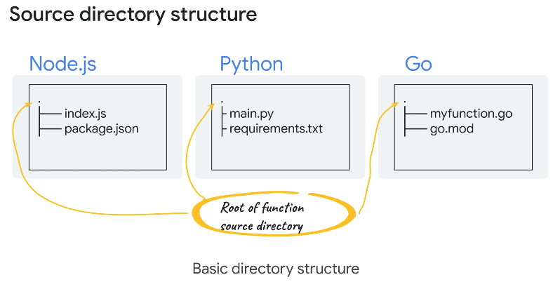
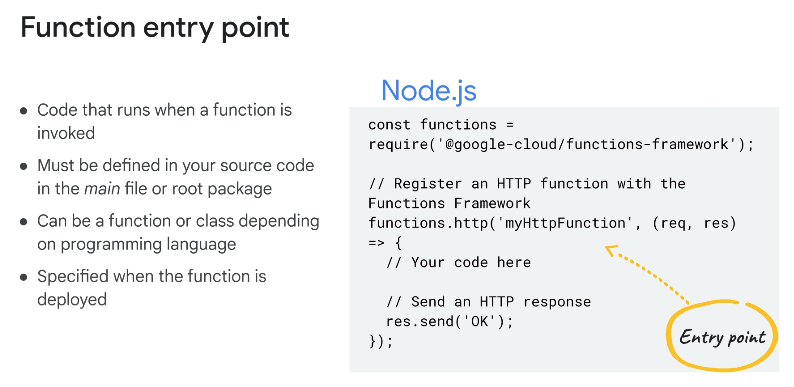
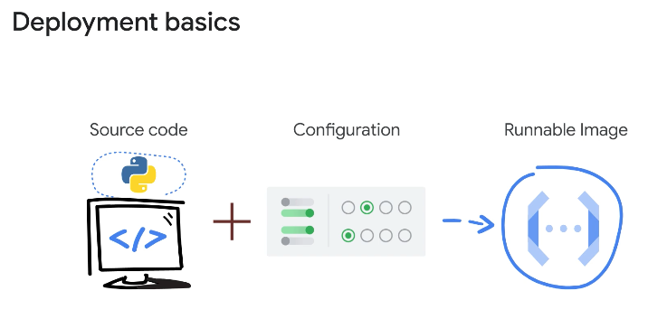
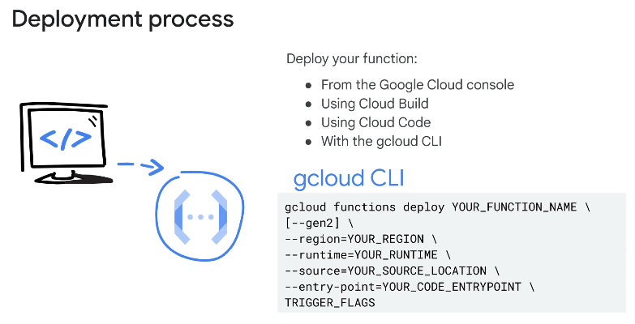

◀️ [Home](../../../../README.md)

## Introduction
Cloud Run functions is a fully managed serverless execution environment on Google Cloud for you to build, deploy, and run functions. It is a scalable functions-as-a-service platform, where there is no need to provision any infrastructure or manage individual servers.

Cloud Run is a managed compute platform that lets you run containers directly on top of Google's scalable infrastructure. You can deploy code written in any programming language on Cloud Run if you can build a container image from it.

A cloud function is simple code that you write that serves a single piece of functionality. It’s triggered by an event that is generated by cloud infrastructure and other services. Cloud functions execute in a fully managed serverless environment. Cloud Run functions provides a connective layer of logic that lets you write code to connect and extend cloud services. To set up and use Cloud Run functions, you: 
1. Develop the function code or logic in one of the supported programming languages.
2. Deploy the function: You can deploy the function using the Google Cloud console or the gcloud CLI.
3. Set up a trigger for the function to execute in response to HTTP requests or supported cloud events.

### Features 
- Local development and testing: You can develop and test functions in a local development environment before deploying to Cloud Run functions.
- Seamlessly authenticate your cloud functions with other Google Cloud services using service accounts.
- HTTP and event-driven: Cloud Run functions execute in response to cloud events and HTTP requests.
- Integration with Cloud SQL, Bigtable, Spanner, and Firestore databases.
- Portability: A function can run in any standard runtime environment for one of the supported languages.

### Benefits 
- Augmenting and extending existing cloud services with programming logic.
- Serverless: The software and infrastructure are fully managed by Google. You don’t need to manage servers, update frameworks, or patch operating systems.
- Autoscaling: Resources are automatically provisioned in response to events. A function can scale from a few invocations a day to many millions of invocations without requiring any additional work.
- Observable: Cloud Run functions are integrated with Google Cloud Observability monitoring and logging tools for observability and error diagnosis.
- Pricing: A pay as you go pricing model is used. The cost is based on the number of function invocations, how long the function runs (compute time), and any data transfer fees for outbound network traffic.

### Two types of Cloud Run functions

- HTTP functions, which handle HTTP requests. Use HTTP functions with HTTP triggers when you want to invoke a function with an HTTP(S) request. When you specify an HTTP trigger for a function, the function is assigned a URL at which it can receive requests. A good use case for using HTTP functions is to implement a webhook or API that handles http requests from other services. To implement an HTTP function, you write an HTTP handler function and register it with the functions framework for your programming language. The handler accepts the request and response arguments, processes the request based on the request method, and sends back an HTTP response.

- Event-driven functions, which handle events from your cloud environment. Use event-driven functions when you want a function to be invoked automatically in response to an event that occurs in your cloud environment. You implement event-driven functions using CloudEvent functions or Background functions depending on your chosen language runtime, and if you’re using Cloud Run functions or Cloud Run functions (1st generation). You can use event triggers for: Pub/Sub, Cloud Storage, Firestore, Firebase, and Eventarc sources.

### Supported language runtimes and regions
The language runtime that you choose and the type of function that you want to write determine the structure of your code and function implementation. For Cloud Run functions to locate your function definition, each language runtime has specific requirements for structuring your source code.

### Deploying Cloud Run functions
The deployment process takes your function source code and configuration settings and builds a runnable image. Cloud Run functions automatically manages the image in order to handle requests to your function.

A user deploying Cloud Run functions must have the Cloud Functions Developer IAM role or a role that includes the same permissions. To deploy Cloud Run functions, a user must also be assigned the Service Account User IAM role on the Cloud Run functions runtime service account.

- You can specify the location of your function source code for deployment with the source flag. You can deploy your function from a local machine. The value of the source flag is a local file system path to the root directory of the function source code. Optionally, use the stage-bucket flag to specify a Cloud Storage bucket to upload your source code to as part of deployment.

- The value of the source flag is the cloud storage path to the bucket that contains the function source code packaged as a zip file. Your function source files must be located at the root of the zip file.

- A source repository. The value of the source flag is a source repository reference to the location of your function source code.

#### Build Process
When you deploy your function's source code to Cloud Run functions, that source is stored in a Cloud Storage bucket. Cloud Build is a service that executes builds on Google Cloud infrastructure. Cloud Build automatically builds your function source code into a container image, and pushes that image to Artifact Registry. Cloud Run functions then accesses this image when it needs to run the container to execute your function. The process of building the image is entirely automatic and requires no direct input from you.

Cloud Run functions uses Artifact Registry to store the images built from your function source code. Artifact Registry is a service that is used to store and manage software artifacts in private repositories, including container images, and language packages. Artifact Registry integrates with Cloud Build to store the packages from your builds.
