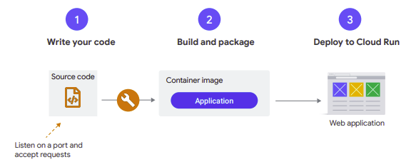
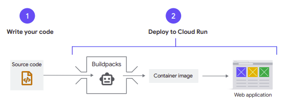
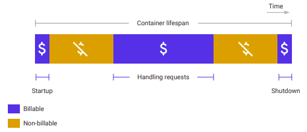
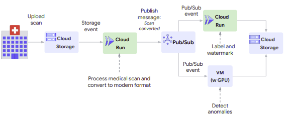
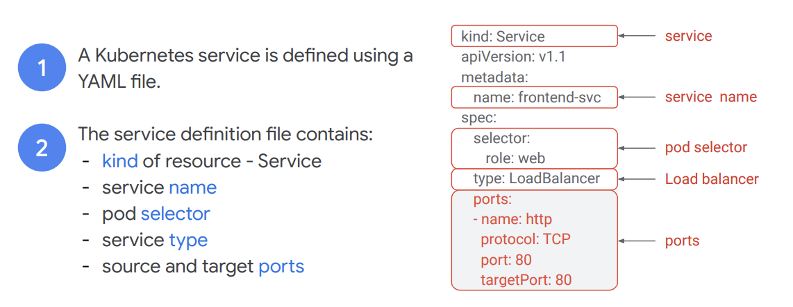
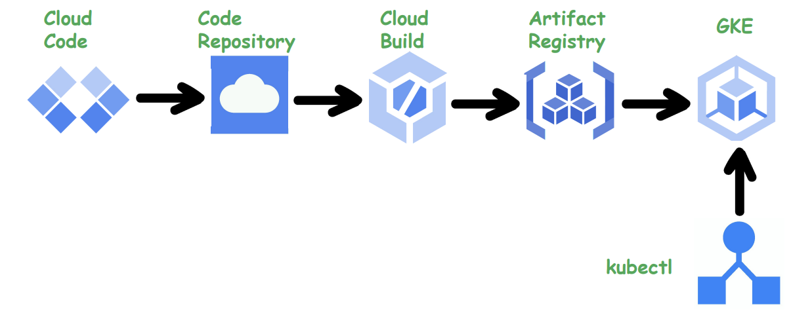
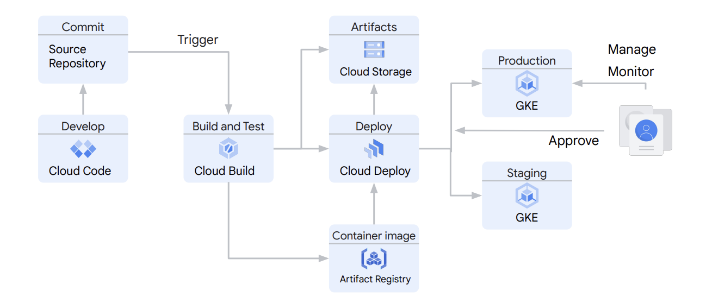
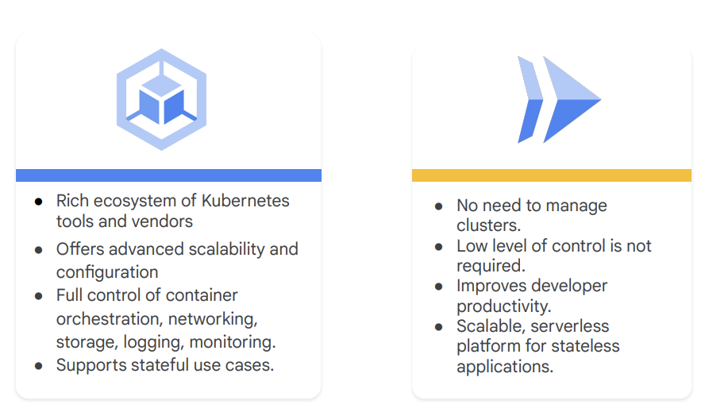

◀️ [Home](../../../../README.md)

## Introduction to Cloud Run and Google Kubernetes Engine
### Cloud Run
Cloud Run is a fully managed compute platform that lets you deploy and run containers directly on top of Google's scalable infrastructure. If you can build a container image of your application code written in any language, you can deploy the application on Cloud Run.

You can use the [source-based deployment](https://cloud.google.com/run/docs/deploying-source-code) option that builds the container for you, when developing your application in Go, Node.js, Python, Java, .NET Core, or Ruby. Cloud Run works well with other services on Google Cloud, so you can build full-featured applications without spending too much time operating, configuring, and scaling your Cloud Run service.

The Cloud Run developer workflow is a three-step process:
1. First, you write your application using your favorite programming language. This application should start a server that listens for web requests.
2. Second, you build and package your application into a container image.
3. Finally, you deploy the container image to Cloud Run. 

Once you’ve deployed your container, you get a unique HTTPS URL. Cloud Run then starts your container on demand to handle requests, and ensures that all incoming requests are handled by dynamically adding and removing containers. Cloud Run is serverless. That means that you, as a developer, can focus on building your application, and not on building and maintaining the infrastructure that powers your application. 

For some use cases, a container-based workflow is great, because it gives you a great amount of transparency and flexibility. If you build the container image yourself, you decide exactly which files are packaged in your container image. However, building an application is hard enough already, and adding containerization adds additional work and responsibilities. If you’re just looking for a way to turn source code into an HTTPS endpoint by creating and deploying a containerized application in a secure, well-configured, and consistent manner, you can use Cloud Run. With Cloud Run, you can use a container-based workflow, and a source-based workflow. If you use the source-based approach, you deploy your source code, instead of a container image. Using Buildpacks, Cloud Run then builds your source, and packages the application along with its dependencies into a container image for you.

Cloud Run supports secure HTTPS requests to your application. On Cloud Run, your application can either run continuously as a service or as a job. Cloud Run services respond to web requests, or events, while jobs perform work and quit when that work is completed.

- Provisions a valid TLS certificate, and other configuration to support HTTPS requests.
- Handles incoming requests, decrypts, and forwards them to your application.

Cloud Run expects your container to listen on port number 8080 to handle web requests. The port number 8080 is a configurable default, so if this port is unavailable to your application, you can change the application’s configuration to use a different port.
You don’t need to provide an HTTPS server, Google’s infrastructure handles that for you.

One major advantage of Cloud Run is that it runs containers. This means you can develop your applications in any programming language and run them on Cloud Run, as long as they can be compiled to a 64-bit Linux binary, and packaged in a container image.

In summary:
- Cloud Run is a managed serverless product on Google Cloud that runs and autoscales containers on-demand.
- You can deploy any containerized application that handles web requests.
- You can employ a source-based or container-based workflow.
- Cloud Run handles HTTPS requests to your application.
- With the Cloud Run pricing model, you only pay for what you use.

#### Features and use cases of Cloud Run
##### Serving a REST API with Cloud Run
A common use case for Cloud Run is to deploy a service that provides a REST API. You can use the service to provide an API, a website, or a web application. If required, you can connect the service to a database to persist data handled by the API or web application.

##### An ecommerce site on Cloud Run
You can build a more complex public website, for example, an e-commerce site on Cloud Run. In this case, you could also:
- Enable Cloud CDN to improve performance,
- Add Google Cloud Armor to filter malicious inbound traffic using content-based policies. In the backend, you can connect with a relational database, a Redis store for user sessions, and connect with third-party APIs.

##### Microservices on Cloud Run
You can deploy and run an application that is composed of many microservices on Cloud Run.
Services on Cloud Run can communicate with each other using REST APIs or gRPC. Using Pub/Sub, you can send and receive asynchronous messages between services with guaranteed delivery. Pub/Sub is well integrated with Cloud Run using push subscriptions. Pub/Sub forwards and optionally authenticates messages as HTTP requests to the endpoint of your Cloud Run service.

##### Event processing on Cloud Run
Cloud Run integrates with various Google Cloud services such as Cloud Storage, Cloud Build, Pub/Sub, Eventarc, and others that generate events from your cloud infrastructure. This enables you to build event processing workflows with Cloud Run. 

When an image of a medical scan is uploaded to Cloud Storage, a Cloud Run service is triggered to process the scanned image and convert it into a modern format. The service then pushes a message to Pub/Sub that triggers another Cloud Run service to label and watermark the converted image, and another VM application that detects anomalies in the scan data. Both services generate output that is stored back in Cloud Storage.

##### Scheduling a Cloud Run service with Cloud Scheduler
You can use Cloud Scheduler to securely trigger a Cloud Run service on a schedule. Cloud Scheduler is a fully-managed cron job scheduler. Some examples of scheduled services include generating invoices, or rebuilding a search index. The limitation of running a scheduled job in the container itself is that the lifetime of a container is only guaranteed while it’s handling requests. If you schedule tasks on a container to run later, the container might be shut down or stopped by the time the task has to run. Note that the Cloud Run service must complete its task within the configured request timeout.

##### Design HA applications with Cloud Run
Cloud Run helps you design applications that are highly available. To support high availability, Cloud Run provides:
- Incremental application updates
- Autoscaling
- Load Balancing across zones and regions

###### Incremental application updates with service revisions
A common cause of service disruptions is often application updates, which affect the availability of your application. On Cloud Run, each deployment of your container image to a service creates a new revision. A service revision is immutable and cannot be modified. If you make a change to your application and deploy it, Cloud Run creates a new revision of your service. A service revision consists of:
- Your container image, and
- The service configuration that includes settings such as environment variables, memory limits, and other configuration values.

You can reduce the impact of request processing failures by splitting request traffic between the new and previous revisions of your service, by specifying the percentage of requests that should be sent to the new revision. This lets you roll back to a previous stable revision if there is a high rate of request failures, or gradually send 100% of request traffic to the new revision.

###### Automatic scaling with Cloud Run
To maintain the capacity to handle incoming requests to your service, Cloud Run automatically increases the number of container instances of a service revision when necessary. This feature is known as autoscaling. Requests to a service revision are distributed across the group of container instances.
- If all container instances are busy, Cloud Run adds additional instances.
- When demand decreases, Cloud Run stops sending traffic to some instances
and shuts them down.
- Note that a container instance can receive many requests at the same time.
With the concurrency setting, you can set the maximum number of requests that can be sent in parallel to a given container instance. In addition to the rate of incoming requests to your service, the number of container instances is impacted by:
- The CPU utilization of existing instances when they are processing requests (with a target of 60% of utilization).
- The maximum concurrency setting.
- The minimum and maximum number of container instances setting.

###### Regions and zones
Cloud Run is a regional service that lets you choose a region where your containers are deployed. A region is a specific geographical location where your Google Cloud resources are hosted. A region consists of three or more zones. Zones and regions are logical abstractions of underlying physical resources that are provided in one or more data centers. An example of a region is us-central1 in Iowa, North America. A zone is a deployment area for cloud resources within a region. Zones are considered to single failure domains within a region. For high availability, Cloud Run distributes your containers over multiple zones in a region, making your application resilient against the failure of a zone.

##### Considerations when using Cloud Run
If you deploy a service that scales up to many container instances, you will incur costs for running those containers. To limit the number of instances during autoscaling, you can set the maximum number of container instances for your Cloud Run service.
- If your Cloud Run service scales up to many container instances in a short period of time, your downstream systems might not be able to handle the additional traffic load. You’ll need to understand the throughput capacity of those downstream systems when configuring your Cloud Run service.
- As part of your application modernization strategy, you’ll need to create a migration plan and use tools to migrate VM-based workloads into containers that will run on Cloud Run or Google Kubernetes Engine.

 

In summary:
- Cloud Run runs and autoscales your application on-demand.
- Use Cloud Run for applications that serve web requests, including microservices, event processing workflows, and scheduled tasks or jobs.
- Automatic scaling, incremental application updates, and built-in load balancing help you build highly available applications.
- Cloud Run is designed to make developers more productive.

### Google Kubernetes Engine
Google Kubernetes Engine (GKE) is a fully managed Kubernetes service. Kubernetes is an open source container orchestration system for automating software deployment, scaling, and management. Originally designed by Google, the project is now maintained by the Cloud Native Computing Foundation (CNCF).

Google Kubernetes Engine provides a managed environment for deploying, managing, and scaling your containerized applications on Google infrastructure. The GKE environment consists of multiple machines or nodes (specifically, Compute Engine instances) that are grouped together to form a cluster.

There is a lot of work that goes into managing a container orchestration system like Kubernetes, from installation and provisioning to upgrades, scaling and meeting service level agreements (SLAs). With Google Kubernetes Engine, you gain the benefit of advanced cluster management features that include:
- Easy cluster creation and management.
- Load balancing.
- Automatic scaling.
- Automatic upgrades of your cluster node software.
- Automatic repair to maintain node health and availability.
- Logging and monitoring with Google Cloud’s operations suite for clustervisibility

#### Control Plane
A GKE cluster consists of one or more control planes and worker machines called nodes. The control plane and nodes make up the Kubernetes cluster orchestration system. GKE manages the entire underlying infrastructure of clusters, including the control plane, nodes, and all system components. The control plane manages everything that runs on all of the cluster's nodes. The control plane schedules container workloads and manages the workloads' lifecycle, scaling, and upgrades. The control plane also manages network and storage resources for those workloads. The control plane and nodes communicate with each other using Kubernetes APIs. The control plane is the unified endpoint for your cluster and runs the Kubernetes API server process (kube-apiserver) to handle API requests. To interact with the control plane, you make Kubernetes API calls using:
- HTTP/gRPC requests.
- Command-line clients such as kubectl, or the Google Cloud console.
The API server process is the hub for all communication for the cluster. All internal cluster components such as nodes, system processes, and application controllers act as clients of the API server.

#### Nodes
Nodes are Compute Engine virtual machines (VMs) that run your containerized applications and other workloads. A node runs the services necessary to support the containers that make up your cluster's workloads. These include the runtime and the Kubernetes node agent (kubelet), which communicates with the control plane, and is responsible for starting and running containers that are scheduled on the node. A pod is the smallest deployable compute unit that you can create and manage in Kubernetes. A pod is a group of one or more containers with shared storage and network resources and a specification for how to run the containers. Pods are not usually created directly, but instead are created using Kubernetes workload resources such as Deployments or Jobs. Pods are ephemeral, disposable entities. When a Pod is created, it’s scheduled to run on a node in the cluster. The Pod remains on that node until it finishes execution, the Pod object is deleted, the Pod is evicted for lack of resources, or the node fails.

#### Kubernetes Deployment
With Kubernetes, you make API requests to specify the desired state for the objects in your cluster. Kubernetes attempts to constantly maintain that state. Kubernetes lets you configure objects in the API either imperatively or declaratively. A Deployment is a declarative way to create and manage pods in Kubernetes. It defines a ReplicaSet that specifies the desired number of pod replicas needed. The purpose of a ReplicaSet is to maintain a stable set of replica pods running at any given time. The Deployment Controller in Kubernetes changes the actual state of the deployment to the desired state at a controlled rate. A deployment is defined using a YAML file that specifies the desired number of pods and a selector label that identifies the pods to be included in the deployment. It also includes a specification that identifies the containers that will run in the pod. The example Deployment manages 4 pod replicas with the role label set to “web.”

#### Kubernetes Service
In Kubernetes, a service is a network abstraction that defines a logical set of pods and a policy by which to access them. The set of pods targeted by a service is usually determined by a selector. A service has a fixed IP address that lasts for the life of the service, even as the IP addresses of it’s member pods change. Because a pod is ephemeral, its IP address changes as it is deleted and re-created. Therefore it doesn't make sense to use Pod IP addresses directly. Clients call the service IP address instead, and their requests are load-balanced across the pods that are members of the service.

#### Kubernetes Service manifest
Like other Kubernetes resources, a service is defined in a manifest file in yaml format.

#### Kubernetes Volume
A Kubernetes Volume is a directory that is accessible to all of the containers in a pod. To use a volume, a pod specifies what volumes to provide for the pod and where to mount those into containers. After the volume is mounted, the containers in the pod are brought online and the rest of pod initialization is completed. There are many different types of volumes in Kubernetes. ConfigMaps and Secrets, are types of volumes that are coupled to the life of the pod and cease to exist when the pod ceases to exist. Alternatively, a PersistentVolume has a lifecycle of its own, independent of the pod.

#### Developing applications for GKE
Now that you have some knowledge of what Kubernetes and GKE is, let’s discuss how you can develop and run your applications on Google Kubernetes Engine. We start with developing your application code. You can use any source code editor or IDE for this, but to make the development process more efficient, you should consider using tools that let you validate your code changes in the developer workspace. Cloud Code is a set of IDE plugins for popular IDEs that make it easier to create, deploy, and integrate applications with Google Cloud. Cloud Code has built-in capabilities such as Kubernetes and Cloud Run explorers which enable you to visualize, and monitor your cluster resources. With Code Repository, Cloud Build, and Container or Artifact Registry, and other Google Cloud tools such as Google Cloud Deploy and Skaffold, you can set up a continuous integration and continuous delivery pipeline that deploys your application to Google Kubernetes Engine. Using the kubectl CLI, you can manage your Kubernetes cluster resources and application workloads.

#### Development and deployment workflow
Using Google Cloud tools, your development and deployment workflow would involve these steps:
1. Use Cloud Code or other editors to create your application source, and store your code in a source code repository such as Cloud Source Repositories, GitHub, or other.
2. Build your application using Cloud Build. Cloud Build lets you set up a CI pipeline that can be triggered from a commit to your source code repository. When a change is committed to the source repository, Cloud Build:
- Rebuilds the application container image.
- Stores the image in Artifact Registry.
- Stores any build artifacts in a Cloud Storage bucket.
- Run tests on the container.
- Calls Google Cloud Deploy to deploy the container to a staging environment which contains a GKE cluster.
3. If the build and tests are successful, use Cloud Deploy to promote the container to a production environment after approval.
4. Manage your application on GKE.
5. Monitor the performance of your application with Google Cloud's operations suite that includes integrated monitoring and logging for your application.

#### Summary
In summary:
- Google Kubernetes Engine is a fully managed Kubernetes service that provides a managed environment for deploying, managing, and scaling your containerized applications on Google infrastructure.
- A GKE cluster consists of one or more control planes and worker machines called nodes. A zonal cluster has a single control plane running in one zone, while a regional cluster has multiple replicas of the control plane, running in multiple zones within a given region.
- The control plane schedules container workloads and manages the workloads' lifecycle, scaling, upgrades, network, and storage resources.
- A pod is a group of one or more containers, and is the smallest deployable compute unit that you can create and manage in Kubernetes.
- In Kubernetes, you configure various kinds of objects in the API either imperatively or declaratively.

### Container-Optimized OS
In addition to Cloud Run and Google Kubernetes Engine, Google Cloud offers Container-Optimized OS, an operating system that you can use to run containerized applications. Container-Optimized OS is an image for Compute Engine VMs that is optimized for running Docker containers. Container-Optimized OS is maintained by Google and is based on the open source Chromium OS project. With Container-Optimized OS, you can start your Docker containers on Google Cloud quickly, and run them efficiently, and securely.

Here are some features and benefits of Container-Optimized OS:
- Run containers out of the box: Container-Optimized OS instances come pre-installed with the Docker runtime and cloud-init. With a Container-Optimized OS instance, you can bring up your Docker container at the same time you create your VM, with no on-host setup required.
- Smaller attack surface: Container-Optimized OS has a smaller footprint, reducing your instance's potential attack surface.
- Locked-down by default: Container-Optimized OS instances include a locked-down firewall and other security settings by default.
- Automatic Updates: Container-Optimized OS instances are configured to automatically download weekly updates in the background; only a reboot is necessary to use the latest updates.

There are also some limitations of Container-Optimized OS:
- A package manager is not included, so you'll be unable to install software packages directly on an instance. However, you can use CoreOS toolbox to install and run debugging and admin tools in an isolated container.
- Container-Optimized OS does not support execution of non-containerized applications.
- The Container-Optimized OS kernel is locked down, so you'll be unable to install third-party kernel modules or drivers.
- Container-Optimized OS is not supported outside of the Google Cloud environment.

You should consider using Container-Optimized OS as the operating system for your Compute Engine instance if:
- You need to run Docker containers with minimal setup.
- You need a secure operating system with a small footprint to run containers.
- You need to run Kubernetes on your Compute Engine instances. Container-Optimized OS may not be the right choice if:
- Your application is not containerized, or your containerized application depends on kernel modules, drivers, and other additional packages that are not available in Container-Optimized OS.
- You want your image and application to be fully supported on platforms other than Google Cloud. Compute Engine provides images for other popular operating systems, including images that are optimized for containers.

### GKE or Cloud Run ?
Let’s briefly discuss how you can choose to use Google Kubernetes Engine or Cloud Run.
To take advantage of the rich ecosystem of tooling and third party vendors around Kubernetes, you should consider adopting GKE. GKE offers advanced scalability and configuration, and keeps you in control over all aspects of your container orchestration including networking, storage, logging and monitoring. GKE also supports stateful use cases of your application.

If you don’t need this level of control, and you want to deploy your services without worrying about managing clusters, while keeping developer productivity a top priority, you should pick Cloud Run. Cloud Run is a scalable, serverless platform for stateless containerized applications and microservices. Since it deploys and run containers, you can develop your code in any language, and use tools and frameworks to build your application into container images that can be deployed on Cloud Run. 

> Cloud Run and GKE work well together. You can always change course later with limited effort.

