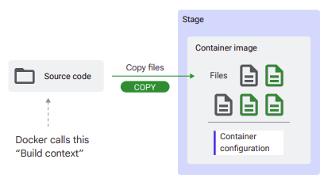

◀️ [Home](../../../../README.md)

## Introduction to Containers
### Containers and container images
**A container is a package of your application code together with dependencies** such as specific versions of programming language runtimes and libraries that are required to run your software services.

**A container image represents a template that defines how a container instance will be realized at runtime**. It packages your application along with everything your application needs to run.
> For example, in a container image for a Java application, your application is packaged together with the appropriate Java Virtual Machine.

Practically, a container image is an archive with files that contains everything your application needs to run. A container image includes system libraries, executable programs, and resources, such as (but not limited to) html files, images, binary blobs, and your application source files. A container image can contain programs written in any programming language, for example Java, Python, JavaScript, PHP, or Go. It can include any binary dependency that you need. This packaging turns your code and resources into something that you can store, download, and send somewhere else.


When you run a container image, you execute one of the programs inside the container image. A container represents the running processes of your application and only exists at runtime. If there are no running processes, there is no container. 


Two other relevant things happen when a container runs:
- The contents of the container image are used to seed a private file system for the container. (All files that the processes of your application see)
- The processes in the container have access to a virtual network interface with a local IP, so your application can bind to this interface and start listening on a port for incoming traffic. 


> - A container image is an archive with files: it includes executables, system libraries, data files, and more.
> - A container image is self-contained. Everything that your application needs to run is inside the container image. If your application is a Node.js application, for example, your source files are in the image along with the Node.js runtime.
> - A container is a runtime instance of a container image and represents the running processes of your container.

After your application is packaged into a container image, you can run it anywhere. On Google Cloud, you can run containers on a Compute Engine in a virtual machine, or on a Kubernetes cluster, or on Cloud Run. On your local machine, you can use the Docker or Podman container runtimes. 

#### Container Image Example
To discover the different types of files that you might find in a container image, let’s look at a very simple example application.


Here’s a minimal Node.js sample web application. The application is made up of three files: server.js, package.json, and index.html. To learn what you need to run the application, let’s review the content in these files.


The server.js file is the main file of the web application. It refers to a library or module dependency (express), which is a web application framework for Node.js. The Express module is used to create an endpoint that returns the contents of the index.html file. The app starts to listen for requests on port 8080.


The package.json file is read by the tool `npm` (the Node.js package manager) to install dependencies. In addition to the application name and version, the package.json specifies the:
- Library dependency: which is the express module, with the exact version number, so that `npm` knows which version to download and install.
- Start command: that instructs how to run the application with the node executable.
- Required Node.js runtime: that specifies the version of Node.js to use.


The index.html is a static HTML file that is returned by the web application on an HTTP request.


To summarize, this sample application requires these five components to run the application:
- The runtime
- Dependencies, which you need to install before you can run the app.
- The source code (javascript files),
- The index.html file (or static assets in general). In reality, you’re likely to have images, CSS files, and more HTML files.
- Configuration, that includes a way to start the application. In this example, it’s “node server.js”, but it can also be more complicated. 


Most web applications written in Python have similar requirements. Python is an interpreted language, so you need a runtime (Python) to run it. In Python applications, you specify dependencies with a requirements.txt file, and you usually install dependencies using the package manager pip. Your source code will be Python files, and the command to start your application is “python server.py” or something similar.

#### Summary
To summarize, the types of files you might need to run your application and be included in a container image are:
- System packages
- A runtime
- Library dependencies
- Source code
- Binaries
- Static assets
- Configuration

> Your application might not need everything on this list. Sometimes you might just have a single binary. The last item is the container configuration. The container configuration details how to turn a container image into a container—a running process. In the previous examples, the command needed to run the application was specified as ‘configuration,’ which is usually an important component. But there’s more!

The command to be run when a container is started is called the entrypoint. Some other important settings are:
- Environment variables, which are used to pass configuration settings to your application.
- A working directory
- The user to run the program with.

It’s important to set the user. If not set, the root user (or system administrator) is used as the default, which is not a best practice for security reasons. When you start the container, you can override the values of application arguments and environment variables.

### Building container images with Docker
Let’s discuss how to build and package an application into a container image.

To build and package your application into a container image, perform these steps:
- Install any system dependencies (if your application depends on them).
- Install a runtime (for example Node.js or Python).
- Download your application’s dependencies (npm install, go get, pip install, or invoking your package manager of choice).
- Compile the binaries (or process / bundle the source code).
- Package the files into the container image.
- Set the container configuration.

```
Source code --> (Build and package) --> Container image
```

Docker is an open platform that enables you to package and run applications in containers. It provides the tools to manage the lifecycle of your containers, from development and packaging to deployment. Docker lets you express the application build process using a script, called a Dockerfile. Dockerfiles provide a low-level approach that offers flexibility at the cost of complexity. The Dockerfile is a manifest that details how to turn your source code into a container image.

#### Docker Build
Docker is a container engine — you can use it to run containers on your local machine. You can also use it to build container images. Docker Build is a set of features and tools in Docker that enable you to build and package your applications into container images. Docker Build takes your source code and a Dockerfile. You express the building and packaging of your source code using a set of instructions in the Dockerfile. 

#### Dockerfile
Here’s an example of a Dockerfile that builds a sample Node.js application into a container image.


The instructions in the Dockerfile:
- Starts from a Node.js base image.
- Creates the application directory in the container file system.
- Copies the source code and other files to the container image.
- Installs the application dependencies excluding any devDependencies listed in the package.json file.
- Sets configuration to run the application when it starts. (node server.js) 

To understand how this works, it’s important to realize that with Docker you build your application inside the container image. You start with putting a container image on a stage, and every Dockerfile instruction changes that staged container image.
The general process is:
- Start with a base image, which contains tooling to build your application.
- Pull your source code and other required files into the container image.
- To build your application, run a program to update files in the image.
- Configure the image to start your application.

> Dockerfiles combine the building and packaging of a container image into a single process. **You start with putting a container image on a stage, and every Dockerfile instruction changes that staged container image.**

##### FROM
The FROM instruction downloads a base image from a registry and puts that on the stage, to be modified by subsequent instructions.


Examples of base images are:
- golang (it has tools to build go programs)
- nodejs (it has tools to install and build node programs)

##### COPY
The COPY instruction pulls in source code. Docker has the concept of a “build context,” which is the set of files in the source code directory.



Use it to bring source code into the staged image that you’ve just downloaded with the FROM instruction. 

##### RUN
The RUN instruction lets you run a program from the image, to change files in the image. This means:
- The program file that you execute needs to be present in the container image.
- The only files accessible to the program are those that exist on the container image.


Examples of tasks that RUN is used for, include:
- Installing another system package that you need to build your application.
- Downloading library dependencies.
- Compiling your source code into binaries.

##### Other instructions
Finally, container configuration tells the container runtime (such as Docker, or Cloud Run), what program file to start from the container image, and with what parameters. 

> Other instructions change the container configuration, which points out which program file to start, and how. 


There are several instructions that can change the container configuration. Examples include:
- ENTRYPOINT: points to the program file to start and run the container as an executable.
- CMD: provides defaults for an executing container, that includes the command to run when the container is started. If the executable command is not specified, then the ENTRYPOINT instruction is required.
- ENV: is used to set environment variables.
- WORKDIR: sets the working directory of the program.
- USER: sets the user to use when starting the program.

> A full reference of all Dockerfile instructions can be found here: https://docs.docker.com/engine/reference/builder/

[Lab: Creating and Running Docker Containers](https://www.cloudskillsboost.google/paths/19/course_templates/530/labs/370143)

> Artifact Registry is a Google Cloud service that is used to store and manage software artifacts in private repositories, including container images, and software packages. You push your container images to Artifact Registry making them available for deployment to other environments such as staging, and production, which make up your software delivery lifecycle.