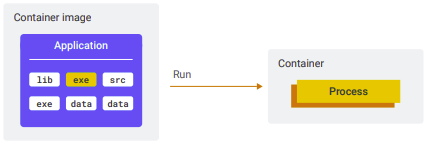
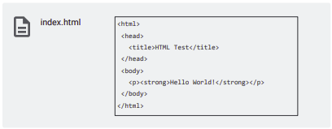

◀️ [Home](../../../../README.md)

## Introduction to Containers
### Containers and container images
**A container is a package of your application code together with dependencies** such as specific versions of programming language runtimes and libraries that are required to run your software services.

**A container image represents a template that defines how a container instance will be realized at runtime**. **It packages your application along with everything your application needs to run**.
> For example, in a container image for a Java application, your application is packaged together with the appropriate Java Virtual Machine.

Practically, a container image is an archive with files that contains everything your application needs to run. A container image includes system libraries, executable programs, and resources, such as (but not limited to) html files, images, binary blobs, and your application source files. A container image can contain programs written in any programming language, for example Java, Python, JavaScript, PHP, or Go. It can include any binary dependency that you need. This packaging turns your code and resources into something that you can store, download, and send somewhere else.


When you run a container image, you execute one of the programs inside the container image. A container represents the running processes of your application and only exists at runtime. If there are no running processes, there is no container. 



Two other relevant things happen when a container runs:
- The contents of the container image are used to seed a private file system for the container. (All files that the processes of your application see)
- The processes in the container have access to a virtual network interface with a local IP, so your application can bind to this interface and start listening on a port for incoming traffic. 


> - A container image is an archive with files: it includes executables, system libraries, data files, and more.
> - A container image is self-contained. Everything that your application needs to run is inside the container image. If your application is a Node.js application, for example, your source files are in the image along with the Node.js runtime.
> - A container is a runtime instance of a container image and represents the running processes of your container.

After your application is packaged into a container image, you can run it anywhere. On Google Cloud, you can run containers on a Compute Engine in a virtual machine, or on a Kubernetes cluster, or on Cloud Run. On your local machine, you can use the Docker or Podman container runtimes. 

#### Container Image Example
To discover the different types of files that you might find in a container image, let’s look at a very simple example application.


Here’s a minimal Node.js sample web application. The application is made up of three files: server.js, package.json, and index.html. To learn what you need to run the application, let’s review the content in these files.


The server.js file is the main file of the web application. It refers to a library or module dependency (express), which is a web application framework for Node.js. The Express module is used to create an endpoint that returns the contents of the index.html file. The app starts to listen for requests on port 8080.


The package.json file is read by the tool `npm` (the Node.js package manager) to install dependencies. In addition to the application name and version, the package.json specifies the:
- Library dependency: which is the express module, with the exact version number, so that `npm` knows which version to download and install.
- Start command: that instructs how to run the application with the node executable.
- Required Node.js runtime: that specifies the version of Node.js to use.



The index.html is a static HTML file that is returned by the web application on an HTTP request.


To summarize, this sample application requires these five components to run the application:
- The runtime
- Dependencies, which you need to install before you can run the app.
- The source code (javascript files),
- The index.html file (or static assets in general). In reality, you’re likely to have images, CSS files, and more HTML files.
- Configuration, that includes a way to start the application. In this example, it’s “node server.js”, but it can also be more complicated. 


Most web applications written in Python have similar requirements. Python is an interpreted language, so you need a runtime (Python) to run it. In Python applications, you specify dependencies with a requirements.txt file, and you usually install dependencies using the package manager pip. Your source code will be Python files, and the command to start your application is “python server.py” or something similar.

#### Summary
To summarize, the types of files you might need to run your application and be included in a container image are:
- System packages
- A runtime
- Library dependencies
- Source code
- Binaries
- Static assets
- Configuration

> Your application might not need everything on this list. Sometimes you might just have a single binary. The last item is the container configuration. The container configuration details how to turn a container image into a container—a running process. In the previous examples, the command needed to run the application was specified as ‘configuration,’ which is usually an important component. But there’s more!

The command to be run when a container is started is called the entrypoint. Some other important settings are:
- Environment variables, which are used to pass configuration settings to your application.
- A working directory
- The user to run the program with.

It’s important to set the user. If not set, the root user (or system administrator) is used as the default, which is not a best practice for security reasons. When you start the container, you can override the values of application arguments and environment variables.

### Building container images with Docker
Let’s discuss how to build and package an application into a container image.

To build and package your application into a container image, perform these steps:
- Install any system dependencies (if your application depends on them).
- Install a runtime (for example Node.js or Python).
- Download your application’s dependencies (npm install, go get, pip install, or invoking your package manager of choice).
- Compile the binaries (or process / bundle the source code).
- Package the files into the container image.
- Set the container configuration.

```
Source code --> (Build and package) --> Container image
```

Docker is an open platform that enables you to package and run applications in containers. It provides the tools to manage the lifecycle of your containers, from development and packaging to deployment. Docker lets you express the application build process using a script, called a Dockerfile. Dockerfiles provide a low-level approach that offers flexibility at the cost of complexity. The Dockerfile is a manifest that details how to turn your source code into a container image.

#### Docker Build
Docker is a container engine — you can use it to run containers on your local machine. You can also use it to build container images. Docker Build is a set of features and tools in Docker that enable you to build and package your applications into container images. Docker Build takes your source code and a Dockerfile. You express the building and packaging of your source code using a set of instructions in the Dockerfile. 

#### Dockerfile
Here’s an example of a Dockerfile that builds a sample Node.js application into a container image.


The instructions in the Dockerfile:
- Starts from a Node.js base image.
- Creates the application directory in the container file system.
- Copies the source code and other files to the container image.
- Installs the application dependencies excluding any devDependencies listed in the package.json file.
- Sets configuration to run the application when it starts. (node server.js) 

To understand how this works, it’s important to realize that with Docker you build your application inside the container image. You start with putting a container image on a stage, and every Dockerfile instruction changes that staged container image.
The general process is:
- Start with a base image, which contains tooling to build your application.
- Pull your source code and other required files into the container image.
- To build your application, run a program to update files in the image.
- Configure the image to start your application.

> Dockerfiles combine the building and packaging of a container image into a single process. **You start with putting a container image on a stage, and every Dockerfile instruction changes that staged container image.**

##### FROM
The FROM instruction downloads a base image from a registry and puts that on the stage, to be modified by subsequent instructions.


Examples of base images are:
- golang (it has tools to build go programs)
- nodejs (it has tools to install and build node programs)

##### COPY
The COPY instruction pulls in source code. Docker has the concept of a “build context,” which is the set of files in the source code directory.


Use it to bring source code into the staged image that you’ve just downloaded with the FROM instruction. 

##### RUN
The RUN instruction lets you run a program from the image, to change files in the image. This means:
- The program file that you execute needs to be present in the container image.
- The only files accessible to the program are those that exist on the container image.


Examples of tasks that RUN is used for, include:
- Installing another system package that you need to build your application.
- Downloading library dependencies.
- Compiling your source code into binaries.

##### Other instructions
Finally, container configuration tells the container runtime (such as Docker, or Cloud Run), what program file to start from the container image, and with what parameters. 

> Other instructions change the container configuration, which points out which program file to start, and how. 


There are several instructions that can change the container configuration. Examples include:
- ENTRYPOINT: points to the program file to start and run the container as an executable.
- CMD: provides defaults for an executing container, that includes the command to run when the container is started. If the executable command is not specified, then the ENTRYPOINT instruction is required.
- ENV: is used to set environment variables.
- WORKDIR: sets the working directory of the program.
- USER: sets the user to use when starting the program.

> A full reference of all Dockerfile instructions can be found here: https://docs.docker.com/engine/reference/builder/

[Lab: Creating and Running Docker Containers](https://www.cloudskillsboost.google/paths/19/course_templates/530/labs/370143)

> Artifact Registry is a Google Cloud service that is used to store and manage software artifacts in private repositories, including container images, and software packages. You push your container images to Artifact Registry making them available for deployment to other environments such as staging, and production, which make up your software delivery lifecycle.

### Building container images with Buildpacks
Buildpacks are a way to turn source code into a container image without writing a Dockerfile. Buildpacks provide developers with a convenient way to work with container images, without thinking about the complexities that come with building them. You can create your own Buildpacks, or use those provided by multiple vendors. Buildpacks are built into Cloud Run to enable a source-based deployment workflow.

Buildpacks are distributed and executed in OCI images called builders. Each builder can have one or more buildpacks.

> OCI stands for the Open Container Initiative, a Linux Foundation project that was started in 2015 to design open standards for operating-system-level virtualization of Linux containers. A builder turns your source code into a container image. The buildpacks do the actual work to build and package the container image. Builders can support source code written in multiple languages.

If a builder starts to process a source directory, it executes two phases of a buildpack:

1. The detect phase
The detect phase runs against your source code to determine if a buildpack is applicable or not.

2. The build phase:
The build phase runs against your source code to set up the build-time and run-time environment, download dependencies and compile your source code (if needed), and set appropriate entry point and startup scripts. 

#### Pack
With the command line tool “pack”, you can use a builder to turn source code into a container image.

> Pack is a tool that is maintained by the Cloud Native Buildpacks project to support the use of buildpacks

The example shows how to use pack to build a source directory using the Google Cloud’s buildpacks builder that’s built into Cloud Run. By running this command on your local machine, you can reproduce the container image in a similar manner as Cloud Run does in Google Cloud.


#### Google Cloud's buildpacks
Google Cloud’s buildpacks are used internally by App Engine, Cloud Functions, and Cloud Run. The Google Cloud’s buildpacks builder supports applications written in Go, Java, Node.js, Python, and .NET Core. You can deploy source code, and container images to Cloud Run. Cloud Run builds source code with Google Cloud’s buildpacks. Google Cloud’s buildpacks are optimized for security, speed, and reusability.

PROJECT_ID=$(gcloud config get-value project)
REGION=us-west1

### Continuous integration and delivery tools
Here we review some of the tools to implement continuous integration and delivery (CI/CD) for your container images.

#### Skaffold
Skaffold is a command-line tool that orchestrates continuous development, continuous integration (CI), and continuous delivery (CD) of container-based and Kubernetes applications.

It’s a Google open source project that provides declarative, portable configuration with a pluggable architecture. Skaffold handles the workflow for building, and deploying your application, and provides building blocks for creating CI/CD pipelines. It can be used to continuously deploy containers to your local or remote Kubernetes cluster, Docker environment, or Cloud Run project.


Skaffold requires a YAML configuration file (skaffold.yaml) that defines how your project is built and deployed.


#### Artifact Registry
Artifact Registry is a service that is used to store and manage software artifacts in
private repositories, including container images, and software packages. It’s the recommended container registry for Google Cloud. Artifact Registry integrates with Cloud Build to store the packages and container images from your builds.

#### Cloud Build
Cloud Build is a service that executes your builds on Google Cloud. With Cloud Build, you can continuously build, test, and deploy your application using a CI/CD pipeline. Cloud Build can import source code from various repositories or cloud storage spaces, execute a build to your specifications, and produce artifacts such as Docker containers or Java archives. To provide instructions to Cloud Build, you create a build configuration file that contains a set of tasks. These instructions can configure builds to fetch dependencies, run unit and integration tests, perform static analyses, and create artifacts with build tools (builders) like docker, gradle, maven, and others.


With Cloud Build, you can build your applications written in Java, Go, Python, Node.js, or any programming language of your choice. Cloud Build integrates with different source code repositories such as GitHub, Bitbucket, and GitLab. You can store your application source code in any of these repositories and use Cloud Build to automate building, testing, and deploying your code. You can use Artifact Registry with Cloud Build to store build artifacts. You can also store artifacts in other storage systems such as Cloud Storage. Cloud Build supports the deployment of your application code to popular deployment platforms such as Cloud Run, Google Kubernetes Engine, Cloud Functions, Anthos, and Firebase.

##### Cloud Build steps
Here’s a basic build configuration file. It is named cloudbuild.yaml and can be written in YAML or JSON format.

```
steps:
- name: 'gcr.io/cloud-builders/docker'
  args: ['build',
  'us-central1-docker.pkg.dev/${PROJECT_ID}/my-repo/my-image', '.']
- name: 'gcr.io/cloud-builders/docker'
  args: ['push',
  'us-central1-docker.pkg.dev/${PROJECT_ID}/my-repo/my-image']
- name: 'gcr.io/google.com/cloudsdktool/cloud-sdk'
  entrypoint: 'gcloud'
  args: ['compute', 'instances', 'create-with-container', 'my-vm-name',
  '--container-image',
  'us-central1-docker.pkg.dev/${PROJECT_ID}/my-repo/my-image']
  env:
  - 'CLOUDSDK_COMPUTE_REGION=us-central1'
  - 'CLOUDSDK_COMPUTE_ZONE=us-central1-a'
```

- Instructions are written as a set of steps. Each step must contain a name field that specifies a cloud builder, which is a container image that runs common tools. In this sample, we have a build step with a docker builder, which is an image running Docker.

- The args field of a step takes a list of arguments and passes them to the builder. The values in the args list are used to access the builder’s entrypoint. If the builder does not have an entrypoint, the first element in the args list is used as the entrypoint.

You can run builds manually or use build triggers. To start a build manually, you use the Google Cloud gcloud CLI or Cloud Build API. You can use a Dockerfile or a Cloud Build configuration file with the gcloud builds submit command. The command first uploads your application source code and other files from the specified directory to Cloud Storage. It then builds the container image containing your application from the instructions specified in the Dockerfile or build configuration file, tags the image with the specified image name and pushes the image to the appropriate registry.

You can run builds automatically with Cloud Build triggers. A Cloud Build trigger automatically starts a build whenever you make any changes to your source code in a Google Cloud Source repository, GitHub, or Bitbucket repository. Build instructions must be supplied in a Dockerfile or Cloud Build configuration file. You must first connect Cloud Build to your source repository before building the code in that repository. Repositories in Cloud Source Repositories are connected to Cloud Build by default.

To create a build trigger, you provide:
- The name, description, and cloud region for the trigger.
- The trigger event in the remote origin of your source code repository, which
can be:
    - A commit or push to a particular branch
    - A commit or push that contains a specific tag
    - A commit to a pull request in GitHub.
- The source repository that contains your source code.
- A regular expression that identifies the source branch or tag.
- The location and type of your build configuration, which can be:
    - A Cloud Build configuration file in YAML or JSON format
    - A Dockerfile
    - Buildpacks
- The email associated with your service account, or the default Cloud Build
service account.

### Best Practices when building and securing containers

- **Base image size**: 
The image size can be larger than expected because the image might be based on the Docker Hub node image (for example) — which comes packed with the system packages you need to build software. Even the Debian package manager apt-get might be included so you can install even more system packages. This base image is more suitable for building than for running software. In production, smaller images are better for security reasons. There might be security vulnerabilities in the additional system packages. 
    - The solution that Docker has for this problem is a multi-stage image build. It involves downloading a new image after you’ve completed your initial build, and copying all application files, assets, and library dependencies. We review this process with an image from the Distroless project that is optimized for running applications, as it contains only the application and its runtime (not build time) dependencies. 
    - Use multi-stage builds to create a minimal container image. In a multi-stage build:
    1. The first stage is built that contains the Node.js image along with the application code using the first set of FROM and COPY instructions.
    2. The second FROM instruction stages a new container image from the Distroless project.
    3. The second COPY command copies the application and dependencies from the previous stage onto the active stage. 

> 1. Base images are bloated with packages that you don’t need for running your application.
> 2. Distroless is a project that provides minimal runtime container images.
> 3. If you repeat the FROM instruction, you create a multi-stage build.
> 4. To finish a build, you copy the application and its dependencies into the final stage.

- **Process and signal handling**: 
Process identifiers (PIDs) are unique identifiers that the Linux kernel gives to each process. The first process launched in a container gets PID 1. Container platforms such as Docker, Kubernetes, and Cloud Run use signals to communicate with the processes inside containers, most notably to terminate them. Because these platforms can only send signals to the process that has PID 1 inside a container, you must launch your process with the CMD or ENTRYPOINT instruction in your Dockerfile. This allows the process to receive signals and gracefully shutdown the app when it’s terminated. Also, because signal handlers aren't automatically registered for the process with PID 1, you must implement and register these signal handlers in your application code.

- **Docker build cache**: 
When building a container image, Docker steps through the instructions in your Dockerfile executing them in the specified order. Each instruction creates a layer in the resulting image. For each instruction, Docker looks for existing image layers in its cache that can be reused. Docker can use its build cache for an image only if all previous build steps used it. By positioning build steps that involve frequent changes at the bottom of the Dockerfile, you can enable faster builds by utilizing the Docker build cache. Because a new Docker image is usually built for each new version of your source code, add the source code to the image as late as possible in the Dockerfile.

- **Vulnerability scanning**:
It’s a best practice to scan your container images for software vulnerabilities, and if found, rebuild the image to include any patches that fix the vulnerabilities, and then redeploy your container. Container Analysis is a service that provides vulnerability scanning and metadata storage for containers on Google Cloud. To fix vulnerabilities that are discovered in your container image, it’s recommended to patch the image with an automated process using your continuous integration pipeline that was originally used to build the image.

Here are some additional best practices to follow when building container images:
- You should keep as few things as possible in your container image, ideally only your app, and remove any unnecessary tools or utilities. This reduces the attack surface of your app and protects it from potential harm from attackers.
- To prevent attackers from modifying root-owned files in your container image using a package-manager such as apt-get, avoid running the app as the root user inside the container. You must also disable or uninstall the sudo command. Also, consider launching the container in read-only mode.
- Build a smaller image to reduce image upload and download times. The smaller the image, the faster a node can download it. By referencing a smaller base image in the FROM instruction of your Dockerfile, you can control the overall size of the resulting container image.
- Provide developers within your organization with a set of common, standard, base images by downloading each base image only once. After the initial download, only the layers that make each container image unique are needed, thus reducing the amount of time needed to build the developer’s container image.

