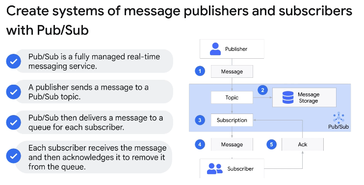
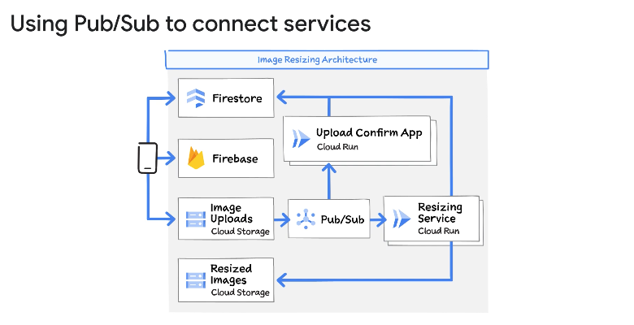
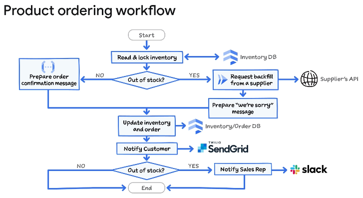
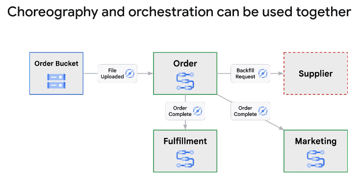
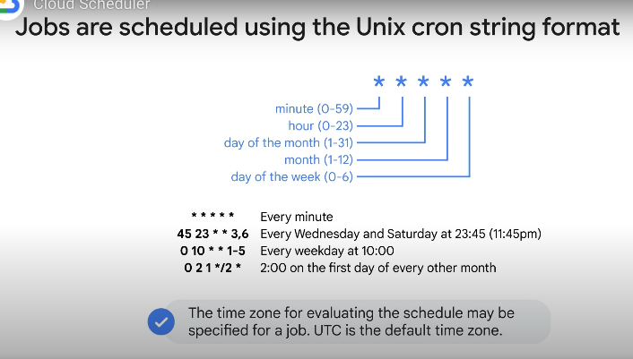
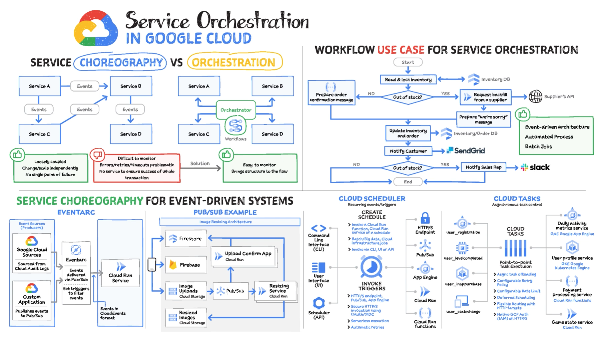

◀️ [Home](../../../../README.md)

## Choreography and Orchestration
There are two basic approaches to microservice coordination in an event-driven architecture: service choreography and service orchestration.

### Coordinating microservices
When you use a microservices architecture, you benefit from scalability, reusability, and ease of change. 
Each microservice is smaller and simpler to design than a monolithic application, but some complexity is shifted from the service to inter-service communications.

Multiple microservices are often combined to form business processes. The coordination of the communication becomes a key aspect of the design of your application.

#### Service choreography
Service choreography has similarities to the choreography of a dance performance. When a dance is choreographed, the dancers are instructed how to perform the dance, but dancers are fully responsible for performing their parts during the performance. 
- Each service is responsible for receiving and sending events asynchronously, typically following defined rules of interaction between services. The event structures that are exchanged between services are specified, and each service must generate and expect services in the correct formats.
- With choreography, services are loosely coupled, and can be created, changed, and scaled separately.
- One choreography challenge is that the business logic is distributed. A distributed application can be harder to understand because there's no central source of truth.

#### Service orchestration
Service orchestration is similar to an orchestra performance. Each musician in the orchestra knows how to play their instrument, but the conductor takes an active role during the performance to ensure that the musicians are synchronized. With service orchestration, each service performs its own tasks, but the central orchestrator controls all interactions between the services. 
- Services do not need to know about or communicate with other services in the orchestration.
- As with service choreography, the services are loosely coupled, and can be created, changed, and scaled separately.
- Another benefit of orchestration is that it provides a high-level view of business processes which helps with understanding the application, tracking execution, and troubleshooting issues.
- Unlike the fully distributed services in the service choreography pattern, service orchestration has a single point of failure. If the orchestrator is not operable, the orchestrated processes cannot run.

### Choreography
Pub/Sub is one of the services on Google Cloud that can be used to choreograph services. It is a fully managed real-time messaging service that lets you send and receive messages between independent services or applications.

Here's an example of using Pub/Sub to connect services and build an application.

Eventarc is Google Cloud's fully managed eventing system that makes building event-driven applications easy. For Google services or event types that do not support direct access, Eventarc can seamlessly use Cloud Audit Logs entries to generate events.

Eventarc is an abstraction layer on top of Pub/Sub that provides some significant benefits when designing an event-driven application. It can use many built-in services as a source for events. Makes it easy to detect changes within many Google Cloud services and third-party applications, and automatically trigger code to run in response to those changes. Provides a simple, rule-based interface to select the source, filter, and destination of a trigger. With Pub/Sub, you must write code to ingest events and manage topics and subscriptions. Finally, you should use Eventarc when you want a standardized event format.

### Orchestration
Workflows is a fully managed orchestration platform which acts as the central orchestrator for the service orchestration pattern. You design and deploy workflows, which orchestrate Google Cloud services and API calls, to build stateful, automated processes. A workflow provides a central source-of-truth for the application flow. Each execution of a workflow is logged and is observable, which makes it easier to understand the current state of the workflow and troubleshoot any issues. A workflow can hold state, retry, poll, or wait for up to a year.

Here's an example product ordering workflow.

Workflows is an excellent choice when you want to chain HTTP-based microservices into durable and stateful workflows. Lets you implement long-running processes and maintain observability for each execution. Also a great choice for performing operations on a set of items or batch data. Robust error handling can guarantee that each item is processed correctly.

### Which one should you use?

Like many application architecture decisions, the answer is "it depends". The better question is "when should I use choreography, and when should I use orchestration?".

When you use event-based choreography, you rely on the receiving service to control the communication. When Service A completes some work and sends an event, Service A has no idea whether any other service will act on that event. It is not the responsibility of Service A to know whether any downstream service or services are consuming the event. Using Eventarc, most Google Cloud or custom services can act as an event producer. A receiver of an event, though, must understand the details of the event to be consumed.

- With orchestration, each workflow execution is tracked separately.
- Choreography provides decentralized control, where each of the services or applications connects to the others using events.
- **Orchestration is a strong pattern when you want to control a complex process that you can manage centrally.**
- **Choreography is more appropriate when combining separate, decentralized services and applications using events, or when you want to leverage events from Google Cloud services.**

In the example shown here, the Order, Fulfillment, and Marketing services are implemented using Workflows. Event triggers between the services and the detection of new order files being uploaded into a Cloud Storage bucket are implemented using Eventarc.

### Cloud Tasks
Cloud Tasks lets you manage the execution, dispatch, and delivery of large numbers of distributed tasks. A task is a piece of work that can be processed independently by dispatching it to an HTTP service. You can set up a queue for tasks that will be sent to a particular service. A task added to this queue will be automatically dispatched to your chosen HTTP service. The returned status code indicates whether the task has been completed successfully or should be retried.

Although Cloud Tasks and Pub/Sub are conceptually similar, both implementing message passing and asynchronous integration, they are designed for different use cases. With Cloud Tasks, the task creator uses explicit invocation, where the creator retains full control over the execution and destination of the task. The creator places the task in a queue attached to a specified endpoint, and the creator can defer the dispatching of the task. With Pub/Sub, the message publisher uses implicit invocation. The publisher implicitly causes any subscribers to execute by publishing the message, but the publisher has no control over which subscribing services receive the message.

Cloud Tasks is appropriate for use cases where an application wants to asynchronously execute a specific service, and possibly control the timing of the execution. Pub/Sub should be used for event-based architectures that rely on receiving services reacting to events generated by other services.

### Cloud Scheduler
Cloud Scheduler is a fully managed, enterprise-grade cron job scheduler which can be managed from a single dashboard. Cloud Scheduler is used to schedule jobs that should be executed on a defined schedule or at regular intervals. Jobs are specified using the familiar Unix cron job format, allowing a job to be run multiple times a day or on specific days and months. Jobs can be sent to Pub/Sub topics, App Engine applications, or publicly accessible HTTP endpoints.

> The Unix cron string format is a set of five space-separated fields on a single line that indicates when a job should be executed. A field can contain a single number, a range of numbers, or a list of numbers and ranges. Ranges are two numbers separated by a hyphen, and the range is inclusive. An asterisk indicates the entire allowed range. Following a range with a slash and a number will skip that number of values throughout the range. A list of numbers or ranges can be specified by separating the values with commas. Your job schedule can be specified for a specific time zone.

