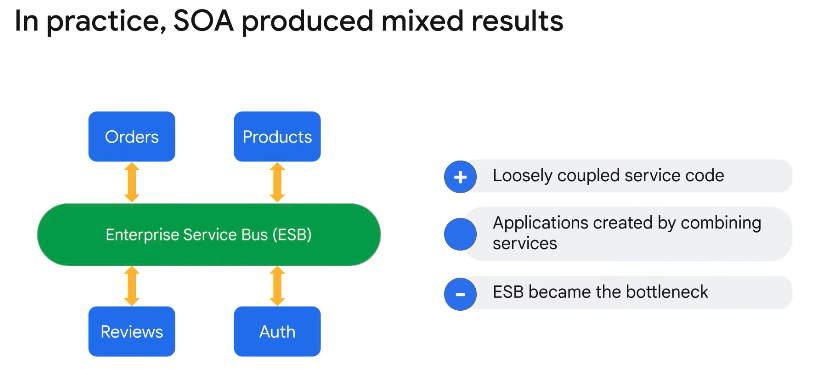

◀️ [Home](../../../../README.md)

## Microservices
An architectural style for developing applications.

Early enterprise applications were developed as large, self-contained applications. These applications included the user interface, business logic, and data access code, with data persisted in a large, relational database. These applications were designed to handle many tasks, and the codebase was necessarily complex. We now call these monolithic applications, or monoliths.

Service-Oriented Architecture, or SOA, was an attempt to solve the challenges of monolithic applications. SOA is an architectural style that focuses on building reusable software components called services. Each service in a service-oriented architecture should execute a discrete business function, ...and communication between services was implemented using messaging over defined service interfaces.

**Microservices are an alternative, decentralized approach to decomposing applications into services. They are separate services, limited in scope.**

A microservice specifies an interface, typically an API, that is used by other services when calling the operations of the microservice. The separation of microservices tends to lead to loose coupling between the microservices. Loosely coupled services are easier to maintain, update, and deploy.

### Benefits
- Smaller codebase: generally allows for a single, small team to focus on the internal details of that microservice.
- Easier for the members of that team to understand the microservice and update it without causing issues in other parts of the application.
- Easier to unit test, because there are clear boundaries between different services.
- Separately deployable, which allows teams to update their microservices on their own schedules.
- More agile development, because microservices can be separately updated and deployed without affecting other services.
- Can use different programming languages and technologies, because microservices connect using an API interface. The programming languages, frameworks, and technologies used by the microservice code do not affect calling services.
- Microservices running on one platform can also connect to microservices running on a different platform.
- Each microservice can be scaled separately, dedicating more resources only to those services that require more capacity.
    - Easy to scale up and down based on fluctuations in traffic.

### Challenges
In a microservices architecture, each microservice tends to be simpler and easier to understand than the monolithic application. Each service can be developed, deployed, and tested separately. However, having more deployable entities causes a greater operational burden for an organization. The operations team must manage tens, hundreds, or thousands of microservices.

**Automated builds, testing, and deployments are vital to maintaining the health and efficiency of your applications and your operational team.** With so many services, it's also important to maintain consistent logging, reporting, security, and authorization for your services.

A microservices architecture includes the communication between microservices, which can be complex. 
- If you do not design your systems well, it can be difficult to understand the "spider web" of communication between microservices.
- They can also introduce communication latency. For a monolith, calls between components are typically in the same process running on the same hardware. With microservices, calls between services happen across the network, which can be thousands of times slower. When a business operation requires many microservice calls, the latency can be significant.
- While unit testing for each microservice can be straightforward, integration testing is typically more challenging. The distributed nature of microservices often means that testing the entire system requires modeling the entire production deployment.
- Debugging a microservices architecture can also be difficult. 
If an application consists of many microservices, and each microservice creates its own logs, tracing calls that span many microservices can be challenging.

> Building microservices requires a commitment to automation and operational excellence, but the benefits of microservices generally outweigh the challenges. Service orchestration and choreography can reduce the complexity of microservice-based applications.
