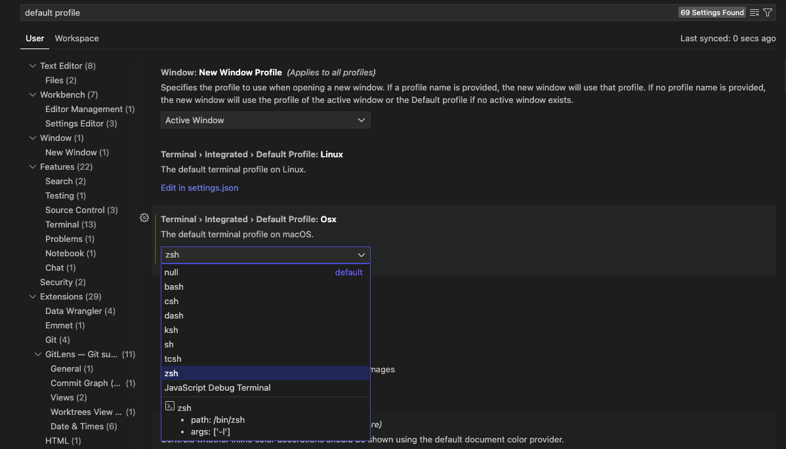
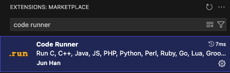
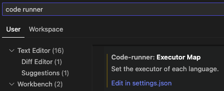
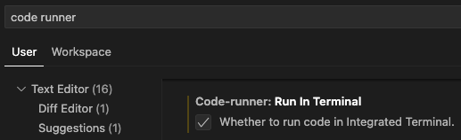

◀️ [Home](../../README.md)

# **VS Code**

## **Cheat Sheet**
A collection of useful VS Code shortcuts to boost your productivity.

### Move lines up and down

Click (or select) a line (or lines), then type:

```bash
option (⌥) + arrow key (⇧)
```

### Duplicate lines up and down

Click (or select) a line (or lines), then type:

```bash
option (⌥) + shift (⇧) + arrow key (⬇️)
```

### Select multiple lines at once

```bash
option (⌥) + mouse-click
```

### Select the next repeated instance of a text

Select a specific text, then type:

```bash
command (⌘) + D
```

### Select the all the repeated instances of a text

Select a specific text, then type:

```bash
command (⌘) + shift (⇧) + L
```

### Search files by name

```bash
command (⌘) + P
```

### Search and run a command

```bash
command (⌘) + shift (⇧) + P
```

### Comment multiple lines at the same time

```bash
command (⌘) + shift (⇧) + /
```
<br>

## Clean Terminal Setup

### Clean Run Execution
Every time you run Python code, the terminal will clear first, so you always see fresh and clean output.

1. Set a default terminal
- Settings > Default Profile



2. Install 'Code Runner' extension



3. Edit the 'Executor Map' file
- Settings > Code-runner: Executor Map
- Then, Click on 'Edit in settings.json'



4. Find the `"code-runner.executorMap": {},` and the languages you will be coding in.

This setting in VS Code is used by the Code Runner extension to define custom command-line instructions for running different programming languages. The executorMap is a JSON object where keys are programming languages (e.g., "python", "javascript") and values are the commands used to execute code for those languages.

5. Clear the terminal before running the Python script.

By changing:

```
"code-runner.executorMap": {
    
    "python": "python -u",

},
```
To:

```
"code-runner.executorMap": {
    
    "python": "clear && python -u",

},
```

- The command clears the terminal (`clear`) before running the Python script.
- `&&` ensures that `python -u` runs only if clear is successful.
- `-u` forces Python to run in unbuffered mode, meaning output is printed immediately.

6. Run Code-runner in Terminal
Scroll down and select 'Code-runner: Run in Terminal'.

