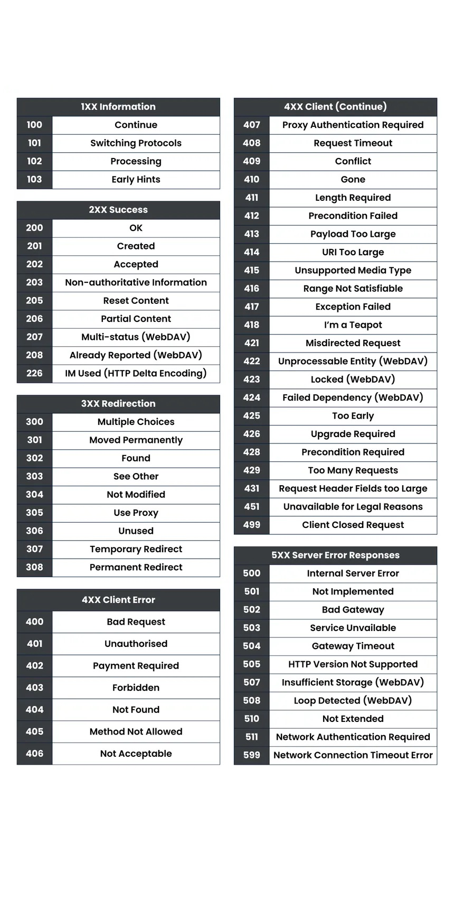

# Web Application Architecture

◀️ [Home](../../README.md)

## URL

### Components

Example:

`https://asset-check.run.app/results?ids=20251015120903_RECKITT_Nurofen_LasVegas_020_004_AT,20251015120903_FY23Q4_Pepsi_MOVIES_Sleek_Black_Fantasy_16x9_6s_1`

- Domain: `https://asset-check.run.app`
- Path/Endpoint: `/results`
- Query Parameter: `?ids=20251015120903_RECKITT_Nurofen_LasVegas_020_004_AT,20251015120903_FY23Q4_Pepsi_MOVIES_Sleek_Black_Fantasy_16x9_6s_1`

### Request/Response

Whenever we visit some type of website we refer to it as the client, or the frontend. Behind the scenes, that frontend is communicating with some type of API (Application Programming Interface) - which is running on a different server - through requests and responses.

> We can think of an API as a backend server that handles all data operations (e.g. creating, reading, updating, deleting).

The request is what we send from the frontend to the backend essentially saying what we want to do. The response is what comes back from the backend to our the client.

#### Request Components

##### Type/Method

- **GET**: Retrieve something
- **DELETE**: Delete something
- **POST**: Create something
- **PUT**/PATCH: Update something

##### Path

The path identifies the resource or action in the API.
Example: `/users/42/orders` means "orders that belong to user 42".

##### Request Body

The request body contains the data you send to the server (usually JSON).
Common with `POST`, `PUT`, and `PATCH`.
Example:

```json
{ "name": "Alice", "role": "admin" }
```

##### Request Headers

Headers provide extra metadata about the request.
Common headers:

- `Authorization`: who is making the request
- `Content-Type`: format of the body (for example `application/json`)
- `Accept`: response format expected by the client

#### Response Components

##### Status Code

The status code tells you if the request succeeded or failed.

- `2xx`: success
- `4xx`: client-side issue (bad request, unauthorized, not found)
- `5xx`: server-side issue



##### Response Body

The response body is the actual data returned by the server.
It can contain results, created/updated data, or an error message.

##### Response Headers

Response headers provide metadata about the response.
Examples:

- `Content-Type`: response format
- `Cache-Control`: caching behavior
- `Set-Cookie`: sends/updates cookies in the browser
